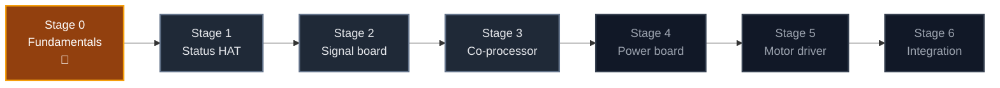

<div align="center">

# 🧠 RoverSpine

### Custom electronics for [RoverPi](https://github.com/AndyChen227/RoverPi), designed from zero PCB experience
### 为 [RoverPi](https://github.com/AndyChen227/RoverPi) 自制的电路板——从零基础开始

**Learn by shipping boards · Verify on the vehicle · Keep every failure**

**用真板子学习 · 在车上验证 · 留下每一次失败**

[](#stages)
[](docs/roadmap.md)
[](https://www.kicad.org/)
[](https://github.com/AndyChen227/RoverPi)

[](#stages)
[](#stages)
[](LICENSES/)
[](LICENSES/MIT.txt)

### [English](#english) · [中文](#chinese) · [Roadmap](docs/roadmap.md) · [RoverPi](https://github.com/AndyChen227/RoverPi)

</div>

---

<a id="english"></a>

# 🇬🇧 English

## Why "Spine"

[RoverPi](https://github.com/AndyChen227/RoverPi) is a Raspberry Pi 5 rover. The
Pi is its **brain**, and this project has no intention of replacing it.

What this project builds is the **spine**. Signals travel down it — PWM and
direction to the motors. Sensation travels up it — wheel encoders, battery
voltage, forward range.

But the reason a spine matters is that **reflexes do not go through the brain**.
A heartbeat watchdog, an emergency-stop button, an over-current trip: each is an
action that must still happen when the brain is gone.

That is the engineering argument for this repository. Today every safety
mechanism on RoverPi lives inside Python — the dead-zone rule, the protected
reversal, the controller-disconnect watchdog. All of them are excellent, all of
them are verified, and **all of them stop existing the moment the Pi hangs**. At
that instant the last PWM value is still applied to the pins and the rover keeps
driving. No amount of better Python fixes that. It takes a wire and a circuit.

## What this repository is

A twelve-month, six-stage learning track that starts from **no PCB experience at
all** and ends with the rover running on electronics its owner designed.

It is a learning journal as much as a hardware project. Boards that failed are
documented as carefully as boards that worked, because on this track a bad board
you understand is worth more than a good board you got lucky with.

<a id="stages"></a>

## Stages

| Stage | Focus | Replaces / Adds | Months | State |
|:---:|---|---|:---:|:---:|
| 0 | Fundamentals — soldering, multimeter, KiCad. **No board is fabricated** | — | 1 | 🔨 Active |
| 1 | Status indicator HAT — LEDs, buzzer, button | Adds: state visible without SSH | 1–2 | 🗓️ Planned |
| 2 | Signal board — connectors and encoder inputs | Replaces: 7 dupont wires | 3–4 | 🗓️ Planned |
| 3 | RP2040 co-processor | Replaces: USB serial adapter · Adds: watchdog, quadrature decode, battery monitor, E-stop | 5–7 | 🗓️ Planned |
| 4 | Power board — 11.1 V → 5 V / 5 A | Replaces: USB power bank | 8–9 | 🗓️ Planned |
| 5 | Motor driver — four independent channels | Replaces: WHEELTEC driver · Adds: per-wheel current sensing | 10–12 | 🔭 Future |
| 6 | Integration — one four-layer mainboard | — | stretch | 🔭 Future |

Full specifications, the gating measurements, the tool budget, and the exit
criteria for every stage are in [`docs/roadmap.md`](docs/roadmap.md).



## What never gets replaced

Two things on the rover are permanently out of scope, and saying so up front
keeps the project honest:

| Part | Why it stays |
|---|---|
| **Raspberry Pi 5** | Replacing the main computer is a different project, not an upgrade to this one |
| **Main power switch** | A physical cutoff must never depend on any board working correctly |

The inline fuse is a third case: this project will add electronic current
limiting, but it will **not** remove the fuse. Electronic protection can fail.
A fuse cannot.

## The one rule

> **The rover must be drivable at the end of every session.**

Every stage keeps the part it replaces. A new board goes on the rover only after
it passes bring-up on the bench, and the part it displaced goes into a labeled
bag rather than the bin. When a board fails on the floor, the fallback is a
five-minute swap.

## How this repository relates to RoverPi

One boundary, applied consistently:

> **Facts about the rover live in [RoverPi](https://github.com/AndyChen227/RoverPi).
> Facts about the boards live here.**

The encoder PPR and its output voltage are facts about the rover's motors, so
they are measured and recorded in RoverPi and merely referenced here as design
inputs. Why a board went to revision B, and what its output ripple measured, are
facts about a board, so they live here.

| This repository | RoverPi |
|---|---|
| KiCad projects, Gerbers, board BOMs | The rover's own BOM and wiring map |
| Board bring-up logs and board photographs | Vehicle devlogs and build photographs |
| Firmware for on-board microcontrollers | The Pi-side control and test code |
| The PCB learning track | The autonomy roadmap, Phases 0–7 |

## Verification status

Nothing in this repository has been fabricated yet. Board status uses the same
three states as RoverPi, and they mean the same things:

- `[x]` — the board met its exit criteria **on the rover**;
- `[~]` — the board exists and powers up, but has not met its exit criteria;
- `[ ]` — pending.

A board is never `[x]` because the schematic looks right.

## Repository map

```text
RoverSpine/
├── README.md
├── LICENSES/                # CERN-OHL-S for hardware, MIT for firmware
├── docs/
│   ├── roadmap.md           # The six stages, in full
│   └── devlog/              # Bilingual per-board logs, including failures
├── hardware/                # One directory per board: KiCad project, Gerbers, BOM
├── firmware/                # On-board microcontroller code, from Stage 3
├── notes/
│   └── debugging/           # Problems, causes, fixes, lessons
└── photos/                  # Board photographs, bare and assembled
```

## Safety

> [!CAUTION]
> This project involves a 3S lithium-polymer battery, motor currents of several
> amperes, and mains-powered soldering equipment. Later stages design switching
> power supplies and H-bridges from scratch.
>
> **Never first-power a board you designed from a battery.** Use a bench supply
> with the current limit set low. A short circuit should be a number on a
> display, not a burnt trace and a dead board.

## Principles

1. **A board that never gets installed taught you nothing.** Every stage ends on the vehicle.
2. **Measure before you draw.** A value invented before the measurement is a guess wearing a footprint.
3. **Keep the old part.** Reversibility is what makes it safe to experiment.
4. **Write down the failures.** They are the reason this repository exists.
5. **Do not claim what was not verified.** Same rule as RoverPi.

---

<a id="chinese"></a>

# 🇨🇳 中文

## 为什么叫 "Spine"（脊髓）

[RoverPi](https://github.com/AndyChen227/RoverPi) 是一台以 Raspberry Pi 5 为主控的
四轮小车。Pi 是它的**大脑**，这个项目从头到尾都没打算取代它。

这个项目做的是**脊髓**。信号沿着它往下传——PWM 和方向信号送到电机；感觉沿着它
往上传——轮式编码器、电池电压、前方距离。

但脊髓真正的意义在于：**反射弧不经过大脑**。心跳看门狗、急停按钮、过流保护，
每一个都是"大脑不在了也必须发生"的动作。

这就是这个仓库存在的工程理由。RoverPi 现在所有的安全机制都活在 Python 里——死区
规则、换向前的断电保护、手柄断线看门狗。它们都很好，也都经过实测验证，但
**Pi 一旦死机，它们全部同时消失**。在那一刻，最后一个 PWM 值仍然挂在引脚上，
车会继续往前开。这个问题写再好的 Python 也解决不了，它需要一根线和一个电路。

## 这个仓库是什么

一条为期十二个月、分六个阶段的学习路线，起点是**完全没有 PCB 经验**，终点是这台
车跑在自己设计的电子系统上。

它既是硬件项目，也是学习日志。失败的板子会和成功的板子记录得一样仔细——在这条
路线上，**一块你搞懂了原因的坏板，比一块蒙对了的好板更值钱**。

## 阶段划分

| 阶段 | 内容 | 替换 / 增加 | 月份 | 状态 |
|:---:|---|---|:---:|:---:|
| 0 | 基本功——焊接、万用表、KiCad。**不做任何板子** | — | 1 | 🔨 进行中 |
| 1 | 状态指示板——LED、蜂鸣器、按钮 | 增加：不用 SSH 也能看到状态 | 1–2 | 🗓️ 计划中 |
| 2 | 信号板——连接器与编码器接口 | 替换：7 根杜邦线 | 3–4 | 🗓️ 计划中 |
| 3 | RP2040 协处理器 | 替换：USB 转串口板 · 增加：看门狗、正交解码、电池监测、急停 | 5–7 | 🗓️ 计划中 |
| 4 | 电源板——11.1V → 5V/5A | 替换：充电宝 | 8–9 | 🗓️ 计划中 |
| 5 | 电机驱动——四路独立 | 替换：WHEELTEC 驱动板 · 增加：单轮电流采样 | 10–12 | 🔭 远期 |
| 6 | 整合——一块四层主板 | — | 选做 | 🔭 远期 |

每个阶段的完整规格、动手前必须先测的量、工具预算和完成判据，都在
[`docs/roadmap.md`](docs/roadmap.md)。

## 永远不替换的东西

车上有两样东西被永久排除在这个项目之外，把这件事提前写清楚，项目才诚实：

| 部件 | 为什么保留 |
|---|---|
| **Raspberry Pi 5** | 换掉主控等于重开一个项目，不是给这个项目做升级 |
| **总电源开关** | 物理断电的全部价值，就在于它不依赖任何电路工作正常 |

保险丝是第三种情况：这个项目会**增加**电子限流，但**不会拿掉**保险丝。
电子保护会失效，保险丝不会。

## 唯一的铁律

> **每次收工时，车必须是能开的。**

每个阶段都保留它所替换的部件。新板只有在台面上完成上电测试之后才允许装车，被换
下来的旧件装进贴好标签的袋子，不扔。板子在地面上出问题时，退路是五分钟换回去。

## 和 RoverPi 的分工

一条规矩，一以贯之：

> **关于车的事实住在 [RoverPi](https://github.com/AndyChen227/RoverPi)，
> 关于板子的事实住在这里。**

编码器的 PPR 和输出电平是**车上电机的事实**，所以在 RoverPi 里测量和记录，这边
只把它当作设计输入引用。某块板为什么改到 B 版、它的输出纹波测出来是多少，是
**板子的事实**，所以住在这里。

| 本仓库 | RoverPi |
|---|---|
| KiCad 工程、Gerber、板子的 BOM | 车的物料清单与接线图 |
| 板子的上电测试日志与板子照片 | 整车开发日志与制作照片 |
| 板载单片机的固件 | Pi 端的控制与测试代码 |
| PCB 学习路线 | 第 0–7 阶段的自主化路线图 |

## 验证状态

本仓库目前还没有打样过任何板子。板子的状态沿用 RoverPi 的三态标记，含义完全相同：

- `[x]` —— 板子已经**在车上**通过完成判据；
- `[~]` —— 板子存在并且能上电，但尚未通过完成判据；
- `[ ]` —— 待办。

**原理图看起来没问题，永远不能标成 `[x]`。**

## 安全

> [!CAUTION]
> 这个项目涉及 3S 锂聚合物电池、数安培的电机电流，以及市电供电的焊接设备。后期
> 阶段还要从零设计开关电源和 H 桥。
>
> **自己设计的板子，第一次上电永远不要用电池。** 用带限流的台面电源，限流值设低。
> 短路应该是显示屏上的一个数字，而不是一道烧断的铜箔加一块废板。

## 原则

1. **装不上车的板子，什么也没教给你。** 每个阶段都以装车收尾。
2. **先测量，再画图。** 测量之前定下来的数值，只是一个套着封装的猜测。
3. **留着旧件。** 可回退，才敢做实验。
4. **把失败写下来。** 这正是这个仓库存在的理由。
5. **没验证过的不许声称。** 和 RoverPi 同一条规矩。
