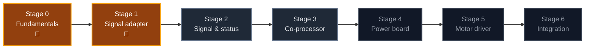

<div align="center">

# 🧠 RoverSpine

### Custom electronics for [RoverPi](https://github.com/AndyChen227/RoverPi), designed from zero PCB experience
### 为 [RoverPi](https://github.com/AndyChen227/RoverPi) 自制的电路板——从零基础开始

**Learn by shipping boards · Verify on the vehicle · Keep every failure**

**用真板子学习 · 在车上验证 · 留下每一次失败**

[](#stages)
[](docs/roadmap.md#stage-1)
[](https://www.kicad.org/)
[](https://github.com/AndyChen227/RoverPi)

[](#stages)
[](#stages)
[](LICENSES/)
[](LICENSES/MIT.txt)

### [English](#english) · [中文](#chinese) · [What it does](#functions) · [Roadmap](docs/roadmap.md) · [RoverPi](https://github.com/AndyChen227/RoverPi)

</div>

---

<a id="english"></a>

# 🇬🇧 English

## Why "Spine"

[RoverPi](https://github.com/AndyChen227/RoverPi) is a Raspberry Pi 5 rover. The
Pi is its **brain**, and this project has no intention of replacing it.

What this project builds is the **spine**. Signals travel down it — PWM and
direction to the motors. Sensation travels up it — wheel encoders, battery
voltage, forward range.

But the reason a spine matters is that **reflexes do not go through the brain**.
A heartbeat watchdog, an emergency-stop button, an over-current trip: each is an
action that must still happen when the brain is gone.

That is the engineering argument for this repository. Today every safety
mechanism on RoverPi lives inside Python — the dead-zone rule, the protected
reversal, the controller-disconnect watchdog. All of them are excellent, all of
them are verified, and **all of them stop existing the moment the Pi hangs**. At
that instant the last PWM value is still applied to the pins and the rover keeps
driving. No amount of better Python fixes that. It takes a wire and a circuit.

## What this repository is

A twelve-month learning track that starts from **no PCB experience at all** and
ends with the rover running on electronics its owner designed.

It runs as **two parallel curves**, and keeping them parallel rather than
sequential is the main scheduling decision in the plan:

| Track | From | To |
|---|---|---|
| **Hardware** — seven stages | Soldering practice and KiCad | A four-layer mainboard |
| **Firmware** — from month 1 | Blinking an LED on a ¥25 Pico | Code that must keep working when the Pi is dead |

The firmware track exists because the boards from Stage 3 onward carry a
microcontroller. Running it from month 1 on a breadboard Pico means Stage 3 is no
longer "a new board and a new language and a new architecture at once"; it becomes
moving proven firmware onto a board of your own.

**The language is deliberately not decided yet.** An earlier version of this plan
committed to C on the Pico SDK — and then withdrew it, because that choice had
been made from reading rather than from writing any code. Month 1 buys two ¥25
Picos and writes the same `blink` in each candidate (C on the Pico SDK, C++ on
arduino-pico, MicroPython); the language is decided at the end of it, from a
measurement. The full reasoning, and the reason **C++ is not the easier one**, is
in [the roadmap](docs/roadmap.md#c-track).

There is also a reason this decision carries less weight than it looks like it
does: the microcontroller has exactly **one irreplaceable job** in this project —
four-channel high-speed quadrature decode. Battery voltage, current sensing, and
even the heartbeat watchdog all have implementations that need no firmware at
all. See [the capability menu](docs/roadmap.md#menu).

It is a learning journal as much as a hardware project. Boards that failed are
documented as carefully as boards that worked, because on this track a bad board
you understand is worth more than a good board you got lucky with.

<a id="stages"></a>

## Stages

| Stage | Focus | Replaces / Adds | Months | State |
|:---:|---|---|:---:|:---:|
| 0 | Fundamentals — soldering, multimeter, KiCad, first code on a Pico, **the language decision**. No board is fabricated | — | 1 | 🔨 Active |
| 1 | Passive signal adapter — pure copper, two keyed connectors | Replaces: 10 dupont wires · Adds: safe state at power-on, and a 3.3 V rail that cannot be mis-plugged into 5 V | 1–2 | 🔨 Active |
| 2 | Signal & status board — encoder inputs, LEDs, buzzer, button | Adds: state visible without SSH · encoders brought in | 3–4 | 🗓️ Planned |
| 3 | RP2040 co-processor | Replaces: USB serial adapter · Adds: watchdog, quadrature decode, battery monitor, E-stop | 5–7 | 🗓️ Planned |
| 4 | Power board — 11.1 V → 5 V / 5 A | Replaces: USB power bank | 8–9 | 🗓️ Planned |
| 5 | Motor driver — four independent channels | Replaces: WHEELTEC driver · Adds: per-wheel current sensing | 10–12 | 🔭 Future |
| 6 | Integration — one four-layer mainboard | — | stretch | 🔭 Future |

> **Renumbered 2026-09-12.** The first board is the passive signal adapter, not
> the status indicator — it is pure copper, so not one component on it can burn,
> and it still teaches the entire pipeline. The status indicator functions moved
> into Stage 2, which had already specified "everything from Stage 1 carried
> forward". Details in [the devlog](docs/devlog/2026-09-12-plan-revision.md).

> **No board in this plan is a HAT.** The Pi 5 carries an active cooler, so
> nothing can stack on its 40-pin header. Every board is a separate board in its
> own enclosure, connected by ribbon cable. See
> [the mechanical constraint](docs/roadmap.md#mechanical).

Full specifications, the gating measurements, the tool budget, and the exit
criteria for every stage are in [`docs/roadmap.md`](docs/roadmap.md).



<a id="functions"></a>

## What the board does

### First, a principle: it replaces boxes, not wires

A board is **rigid** and lives in one place. The motors sit at four corners of
the chassis, the lidar at the front, the battery on the lower deck. Any two
parts that are physically apart need a flexible connection between them, and
that is a wire. Geometry decides this, not design skill.

So "replacing the dupont wires" does not mean the wires go away:

| | Today | With the board |
|---|---|---|
| Form | Loose dupont jumpers, held on by friction | Latching connectors and a made-up harness |
| Labelling | Memory and wire colour | Silkscreen on the board: `PWM1`, `INA1`, … |
| Count | 10 | **Possibly more** — the encoders arrive too |
| What changes | | **Reliability.** The rover vibrates, a dupont jumper works loose, and a loose direction pin means undefined motor behavior |

The same applies at the other end. When Stage 5 replaces the motor driver, the
wires from the driver to the motors are still wires — only what sits at the end
of them changes.

### 1 · Replaces existing parts

| # | What it replaces | Stage | The problem today | How the board solves it |
|---:|---|:---:|---|---|
| 1 | The 10 dupont control wires | 1 | Vibration works them loose; a detached direction pin is undefined behavior; and `V` can be mis-plugged into 5 V, which destroys the driver's isolated input | Keyed boxed connectors, silkscreen labels, and 3.3 V hard-wired in copper |
| 2 | CH9102F USB serial adapter | 3 | Unsecured, occupies a USB port, one more thing to fail | Lidar UART goes straight into the on-board MCU |
| 3 | USB power bank | 4 | Charges separately, runs out, takes up space | On-board 11.1 V → 5 V / 5 A, one battery for the whole rover |
| 4 | WHEELTEC motor driver | 5 | Two motors paralleled per channel — no per-wheel control, no current feedback | Four independent H-bridge channels |
| 5 | Inline fuse — **augmented, never removed** | 5 | A fuse only protects against one failure mode | Electronic over-current added; **the physical fuse stays** |

> [!CAUTION]
> **Item 1 buys more than tidiness, and this is the strongest single argument for
> the whole board.** One of the ten wires is `V`, the 3.3 V supply for the
> driver's *isolated* control side. On the Pi header, 3.3 V is pins 1 and 17 —
> while 5 V is pins 2 and 4, one row over and immediately adjacent.
>
> A dupont wire can be moved onto pin 2 by mistake in a second, and 5 V into a
> 3.3 V isolated input is a **damaged part**, not a stall or a twitch. A copper
> trace from pin 1 to `V` cannot be mis-plugged at all, so that failure mode
> disappears permanently. Details in
> [the correction devlog](docs/devlog/2026-09-12-d50a-control-header-correction.md).


### 2 · Adds — safety that software cannot provide

| # | Function | Stage | The problem today | How it works |
|---:|---|:---:|---|---|
| 6 | **Heartbeat watchdog** | 3 | If the Pi hangs, the last PWM value stays on the pins and the rover keeps driving | The Pi must toggle a pin continuously; stop for ~200 ms and hardware pulls the driver enable low |
| 7 | **Safe state at power-on** | 1 | Between Pi power-on and the script starting, GPIO states are undefined — the motors can twitch | Pull-down resistors on the driver inputs, so unattended means **stopped**. Pads are reserved on Rev A and may ship unpopulated |
| 8 | Physical E-stop button | 3 | Only Ctrl+C or the main switch | The button sits in the enable path, bypassing software entirely |
| 9 | Battery voltage monitor | 3 | **Nothing is watching.** A 3S pack below 9.9 V is permanent damage | Resistor divider into an ADC, with a warning threshold well above the damage point |
| 10 | Motor over-current / stall cutoff | 5 | Stall current is bounded only by the fuse | Per-channel current sense feeding a fast cutoff |

> Item 7 is the cheapest safety feature on this list — a few resistors — and it
> closes a real class of power-on twitch that no amount of Python can reach,
> because the Python is not running yet.

### 3 · Adds — sensing and interaction

| # | Function | Stage | Why it needs a board |
|---:|---|:---:|---|
| 11 | Four-channel hardware quadrature decoding | 3 | ~28 000 edges/s across four wheels at full speed. Python drops counts **silently**, and a lying odometer is worse than none |
| 12 | Battery voltage reading | 3 | **The Raspberry Pi has no ADC at all.** Without added silicon it can never read any analog quantity |
| 13 | Per-wheel current sensing | 5 | Required by Phase 3's PID and by honest stall detection |
| 14 | Four status LEDs | 2 | Serves the "run without SSH" milestone — you need to see the state with no terminal |
| 15 | Buzzer | 2 | Audible state changes, without watching a screen |
| 16 | User button | 2 | Start and mode-switch without a login session |
| 17 | Regulated supply for sensors | 2+ | Today every new sensor needs its own power arrangement invented for it |

### 4 · Reserved for what comes later

Headers and footprints cost almost nothing to add and cannot be added after the
board is fabricated. These are placed now and populated when the rover needs them.

| # | What is reserved | Serves | Note |
|---:|---|---|---|
| 18 | I2C header and IMU footprint | Phase 4 | Heading. The decision waits on the Phase 3 square-test error, but **the interface is free to reserve** |
| 19 | Servo header, separately powered | Phase 4 | Lidar sweep. Servo current spikes must not share a rail with logic |
| 20 | Two bumper switch inputs | Phase 1 / 4 | **Covers the lidar's blind spot** — the ≤2 mm beam cannot see a chair leg; a bumper can |
| 21 | Cliff / drop sensor inputs | Phase 4 | Stops the rover driving off a step |
| 22 | Ultrasonic or IR range header | Phase 4 | Much wider coverage than a single beam; complementary, not a replacement |
| 23 | Spare GPIO, UART, and I2C brought out | All | The cheapest insurance on the board. Unused pads are free; missing ones cost a fabrication run |

### 5 · Out of scope — never replaced

Saying this up front keeps the project honest and stops it growing into
"rebuild the whole rover":

| Part | Why it stays |
|---|---|
| **Raspberry Pi 5** | Replacing the main computer is a different project, not an upgrade to this one |
| **Main power switch** | A physical cutoff must never depend on any board working correctly |
| **Inline fuse** | Electronic protection can fail. A fuse cannot |

### 6 · Out of scope — things a board cannot help with

| Planned capability | Board involved? | Why not |
|---|:---:|---|
| Camera (Phase 5) | ❌ | Uses the Pi's own CSI ribbon, bypassing the board |
| 2D scanning lidar | ❌ | USB, straight into the Pi |
| Wi-Fi, Bluetooth, the gamepad | ❌ | Built into the Pi |
| ROS 2 (Phase 6) | ❌ | Pure software |
| SLAM and path planning (Phase 7) | ❌ | Pure software and compute |
| Automatic controller discovery | ❌ | Pure software — a Phase 1 item this project cannot help with |
| More compute for the Pi | ❌ | The on-board MCU is a co-processor, not an accelerator |

### In one sentence

> The board is the **meeting point** for every electrical connection on the
> rover, and the **protective layer** between the brain and the muscles.

It adds **no autonomy** — that all lives in software. What it adds is
**reliability** and **observability**.

## The one rule

> **The rover must be drivable at the end of every session.**

Every stage keeps the part it replaces. A new board goes on the rover only after
it passes bring-up on the bench, and the part it displaced goes into a labeled
bag rather than the bin. When a board fails on the floor, the fallback is a
five-minute swap.

## How this repository relates to RoverPi

One boundary, applied consistently:

> **Facts about the rover live in [RoverPi](https://github.com/AndyChen227/RoverPi).
> Facts about the boards live here.**

The encoder PPR and its output voltage are facts about the rover's motors, so
they are measured and recorded in RoverPi and merely referenced here as design
inputs. Why a board went to revision B, and what its output ripple measured, are
facts about a board, so they live here.

| This repository | RoverPi |
|---|---|
| KiCad projects, Gerbers, board BOMs | The rover's own BOM and wiring map |
| Board bring-up logs and board photographs | Vehicle devlogs and build photographs |
| Firmware for on-board microcontrollers | The Pi-side control and test code |
| The PCB learning track | The autonomy roadmap, Phases 0–7 |

## Verification status

Nothing in this repository has been fabricated yet. Board status uses the same
three states as RoverPi, and they mean the same things:

- `[x]` — the board met its exit criteria **on the rover**;
- `[~]` — the board exists and powers up, but has not met its exit criteria;
- `[ ]` — pending.

A board is never `[x]` because the schematic looks right.

## Repository map

```text
RoverSpine/
├── README.md
├── LICENSES/                # CERN-OHL-S for hardware, MIT for firmware
├── docs/
│   ├── roadmap.md           # The seven stages, in full
│   ├── fabrication.md       # How a KiCad project becomes a board in your hand
│   ├── tools-and-parts.md   # Inventory + dated log of every tool and part
│   └── devlog/              # Bilingual per-board logs, including failures
├── hardware/                # One directory per board: KiCad project, Gerbers, BOM
├── firmware/                # On-board microcontroller code, from month 1
├── notes/
│   └── debugging/           # Problems, causes, fixes, lessons
└── photos/                  # Board photographs, bare and assembled
```

## Safety

> [!CAUTION]
> This project involves a 3S lithium-polymer battery, motor currents of several
> amperes, and mains-powered soldering equipment. Later stages design switching
> power supplies and H-bridges from scratch.
>
> **Never first-power a board you designed from a battery.** Use a bench supply
> with the current limit set low. A short circuit should be a number on a
> display, not a burnt trace and a dead board.

## Principles

1. **A board that never gets installed taught you nothing.** Every stage ends on the vehicle.
2. **Measure before you draw.** A value invented before the measurement is a guess wearing a footprint.
3. **Keep the old part.** Reversibility is what makes it safe to experiment.
4. **Write down the failures.** They are the reason this repository exists.
5. **Do not claim what was not verified.** Same rule as RoverPi.

---

<a id="chinese"></a>

# 🇨🇳 中文

## 为什么叫 "Spine"（脊髓）

[RoverPi](https://github.com/AndyChen227/RoverPi) 是一台以 Raspberry Pi 5 为主控的
四轮小车。Pi 是它的**大脑**，这个项目从头到尾都没打算取代它。

这个项目做的是**脊髓**。信号沿着它往下传——PWM 和方向信号送到电机；感觉沿着它
往上传——轮式编码器、电池电压、前方距离。

但脊髓真正的意义在于：**反射弧不经过大脑**。心跳看门狗、急停按钮、过流保护，
每一个都是"大脑不在了也必须发生"的动作。

这就是这个仓库存在的工程理由。RoverPi 现在所有的安全机制都活在 Python 里——死区
规则、换向前的断电保护、手柄断线看门狗。它们都很好，也都经过实测验证，但
**Pi 一旦死机，它们全部同时消失**。在那一刻，最后一个 PWM 值仍然挂在引脚上，
车会继续往前开。这个问题写再好的 Python 也解决不了，它需要一根线和一个电路。

## 这个仓库是什么

一条为期十二个月的学习路线，起点是**完全没有 PCB 经验**，终点是这台车跑在自己
设计的电子系统上。

它由**两条并行的曲线**组成，而"让它们并行而不是串行"是整个计划里最主要的排期决策：

| 线 | 起点 | 终点 |
|---|---|---|
| **硬件线**——七个阶段 | 焊接练习与 KiCad | 一块四层主板 |
| **固件线**——从第 1 个月起 | 在一块 ¥25 的 Pico 上点亮 LED | 在 Pi 已经死掉时仍必须正常工作的代码 |

固件线之所以存在，是因为第 3 阶段起的板子都带单片机。从第 1 个月就在面包板上的 Pico
上跑，意味着第 3 阶段不再是"同时面对新板子、新语言、新架构"，而变成把已经验证过的固件
搬到自己的板上。

**语言是刻意还没定的。** 这份计划早先的版本定了 C + Pico SDK，后来撤回了——因为那个选择
是**读来的判断，不是写出来的结论**。第 1 个月花 ¥50 买两块 Pico，用每个候选（Pico SDK 的
C、arduino-pico 的 C++、MicroPython）各写一遍同一个 `blink`，月末根据实测定。完整理由，
以及**为什么 C++ 并不是更简单的那个**，见[路线图](docs/roadmap.md#c-track)。

还有一个理由让这个决定没那么关键：单片机在这个项目里只有**一个真正不可替代的用途**——
四路高速正交解码。电池电压、电流采样，甚至心跳看门狗，都有完全不需要固件的实现方式。
见[功能清单](docs/roadmap.md#menu)。

它既是硬件项目，也是学习日志。失败的板子会和成功的板子记录得一样仔细——在这条
路线上，**一块你搞懂了原因的坏板，比一块蒙对了的好板更值钱**。

## 阶段划分

| 阶段 | 内容 | 替换 / 增加 | 月份 | 状态 |
|:---:|---|---|:---:|:---:|
| 0 | 基本功——焊接、万用表、KiCad，在 Pico 上写第一段代码，**并定下语言**。不做任何板子 | — | 1 | 🔨 进行中 |
| 1 | 被动信号转接板——纯铜，两个防呆连接器 | 替换：10 根杜邦线 · 增加：上电默认安全状态，以及一条插不到 5 V 上的 3.3 V | 1–2 | 🔨 进行中 |
| 2 | 信号与状态板——编码器接口、LED、蜂鸣器、按钮 | 增加：不用 SSH 也能看到状态 · 编码器接进来 | 3–4 | 🗓️ 计划中 |
| 3 | RP2040 协处理器 | 替换：USB 转串口板 · 增加：看门狗、正交解码、电池监测、急停 | 5–7 | 🗓️ 计划中 |
| 4 | 电源板——11.1V → 5V/5A | 替换：充电宝 | 8–9 | 🗓️ 计划中 |
| 5 | 电机驱动——四路独立 | 替换：WHEELTEC 驱动板 · 增加：单轮电流采样 | 10–12 | 🔭 远期 |
| 6 | 整合——一块四层主板 | — | 选做 | 🔭 远期 |

> **2026-09-12 重新编号。** 第一块板改成被动信号转接板，不是状态指示板——它是纯铜的，
> 板上没有一个元件会烧，但教的仍然是完整的一条流水线。状态指示功能并进了第 2 阶段，
> 因为原第 2 阶段的规格里本来就写着"第 1 阶段的东西全部继承过来"。
> 详情见[开发日志](docs/devlog/2026-09-12-plan-revision.md)。

> **这份计划里没有一块板是 HAT。** 树莓派 5 上装了主动散热器，40 针排针上不能再叠东西。
> 每块板都是装在自己小外壳里的独立板，用排线连接。见[机械约束](docs/roadmap.md#mechanical)。

每个阶段的完整规格、动手前必须先测的量、工具预算和完成判据，都在
[`docs/roadmap.md`](docs/roadmap.md)。

<a id="functions-cn"></a>

## 这块板做什么

### 先讲一个原理：它替换的是"盒子"，不是"线"

板子是**刚性的**，装在一个固定位置。而电机分布在底盘四个角、激光在车头、电池在
下层。任何两个**物理上分开**的部件之间，都必然需要柔性连接，那就是线。这是几何
决定的，不是设计水平的问题。

所以"替换杜邦线"并不意味着线会消失：

| | 现在 | 有了板子之后 |
|---|---|---|
| 形态 | 松散的杜邦跳线，靠摩擦力插着 | 带锁扣的连接器 + 成型线束 |
| 标注 | 靠记忆和线的颜色 | 板上有丝印：`PWM1`、`INA1`…… |
| 数量 | 10 根 | **可能更多**——编码器也要接进来 |
| 变的是什么 | | **可靠性。** 车在振动，杜邦线会松脱，而一根脱落的方向线意味着电机行为未定义 |

另一端同理。Stage 5 换掉驱动板之后，驱动到电机之间的线**仍然是线**，变的只是
线另一头连着什么。

### 1 · 替换现有部件

| # | 替换什么 | 阶段 | 现在的问题 | 板子怎么解决 |
|---:|---|:---:|---|---|
| 1 | Pi↔驱动板 的 10 根杜邦线 | 1 | 振动使其松脱；方向线一旦脱落，电机行为未定义；而 `V` 插错到 5 V 上会烧掉驱动板的隔离输入 | 防呆牛角座、丝印标注，3.3 V 焊死在铜里 |
| 2 | CH9102F USB 转串口板 | 3 | 悬空晃动、占一个 USB 口、多一层故障点 | 激光 UART 直接进板载 MCU |
| 3 | 充电宝 | 4 | 要单独充电、会没电、占空间 | 板载 11.1V → 5V/5A，整车一块电池 |
| 4 | WHEELTEC 驱动板 | 5 | 每通道并联两个电机——无法单轮控制，也没有电流反馈 | 四路独立 H 桥 |
| 5 | 保险丝——**只增强，绝不移除** | 5 | 保险丝只能防住一种失效模式 | 增加电子过流保护，**物理保险丝保留** |

> [!CAUTION]
> **第 1 项买到的不只是整洁，而且这是整块板最强的一个理由。** 十根线里有一根是 `V`，
> 它是驱动板**隔离**控制侧的 3.3 V 供电。而树莓派排针上，3.3 V 是 1 号和 17 号针，
> **5 V 是 2 号和 4 号针**——就在隔壁一排，紧挨着。
>
> 杜邦线一秒钟就能插错到 2 号针上，而 5 V 灌进 3.3 V 的隔离输入是**烧器件**，不是停车、
> 也不是抽动。而从 1 号针到 `V` 的一段铜箔**根本无法插错**，这个失效模式永久消失。
> 详情见[那篇更正日志](docs/devlog/2026-09-12-d50a-control-header-correction.md)。


### 2 · 新增：软件做不到的安全功能

| # | 功能 | 阶段 | 现在的问题 | 原理 |
|---:|---|:---:|---|---|
| 6 | **心跳看门狗** | 3 | Pi 一旦死机，最后的 PWM 值仍挂在引脚上，车继续往前开 | Pi 必须持续翻转一个引脚；停止超过约 200 ms，硬件直接拉低驱动使能 |
| 7 | **上电默认安全状态** | 1 | 从 Pi 上电到脚本启动之间，GPIO 状态不确定，电机可能抽动 | 驱动输入加下拉电阻，**无人驱动时默认为停**。Rev A 先留焊盘，可以不焊 |
| 8 | 物理急停按钮 | 3 | 现在只能靠 Ctrl+C 或总开关 | 按钮直接进使能回路，完全绕过软件 |
| 9 | 电池电压监测 | 3 | **完全没人看着。** 3S 电池掉到 9.9 V 以下即永久损坏 | 分压进 ADC，报警阈值设在损坏点之上很多 |
| 10 | 电机过流 / 堵转切断 | 5 | 堵转电流现在只受保险丝约束 | 单通道电流采样，触发快速切断 |

> 第 7 条是这张表上最便宜的安全功能——几个电阻的事——但它堵住的是一类 Python
> 永远够不着的上电抽动，因为在那个时刻 Python 还没开始运行。

### 3 · 新增：感知与交互

| # | 功能 | 阶段 | 为什么需要板子 |
|---:|---|:---:|---|
| 11 | 四路硬件正交解码 | 3 | 满速下四轮合计约 28000 边沿/秒。Python 会**悄无声息**地丢计数，而会说谎的里程计比没有里程计更糟 |
| 12 | 电池电压读数 | 3 | **树莓派根本没有 ADC。** 不加芯片，它永远读不到任何模拟量 |
| 13 | 单轮电流采样 | 5 | 第 3 阶段的 PID 和真实的堵转检测都需要 |
| 14 | 四个状态 LED | 2 | 服务于"脱离 SSH 运行"——没有终端时你得能看见状态 |
| 15 | 蜂鸣器 | 2 | 状态变化用声音提示，不必盯着屏幕 |
| 16 | 用户按钮 | 2 | 不用登录就能启动和切换模式 |
| 17 | 传感器统一稳压供电 | 2+ | 现在每加一个传感器，都要为它单独想一次取电方案 |

### 4 · 为以后预留

排针和焊盘加上去几乎不花钱，但**板子做出来之后就再也加不了**。所以现在先留，
等车真正需要的时候再焊上元件。

| # | 预留什么 | 服务于 | 说明 |
|---:|---|---|---|
| 18 | I2C 排针与 IMU 焊盘 | 第 4 阶段 | 航向角。要不要用取决于第 3 阶段方形测试的误差，但**接口本身留着不花钱** |
| 19 | 舵机接口，独立供电 | 第 4 阶段 | 激光扫描。舵机的电流尖峰绝不能和逻辑电源共用一路 |
| 20 | 两路碰撞开关输入 | 第 1 / 4 阶段 | **补上激光的盲区**——那束 ≤2 mm 的光看不见椅子腿，碰撞开关看得见 |
| 21 | 跌落 / 悬空传感器输入 | 第 4 阶段 | 防止车从台阶上开下去 |
| 22 | 超声波或红外测距接口 | 第 4 阶段 | 覆盖面比单点激光宽得多；是互补，不是替代 |
| 23 | 备用 GPIO、UART、I2C 引出 | 全部阶段 | 板上最便宜的保险。多留几个焊盘不要钱，少留了就得重新打样 |

### 5 · 范围之外——永远不替换

把这件事提前写清楚，项目才诚实，也才不会膨胀成"重造一台车"：

| 部件 | 为什么保留 |
|---|---|
| **Raspberry Pi 5** | 换掉主控等于重开一个项目，不是给这个项目做升级 |
| **总电源开关** | 物理断电的全部价值，就在于它不依赖任何电路工作正常 |
| **保险丝** | 电子保护会失效，保险丝不会 |

### 6 · 范围之外——板子帮不上忙的事

| 以后想做的功能 | 板子参与吗 | 为什么不参与 |
|---|:---:|---|
| 摄像头（第 5 阶段） | ❌ | 走 Pi 自己的 CSI 排线，绕过板子 |
| 2D 旋转激光雷达 | ❌ | USB 接口，直接进 Pi |
| WiFi、蓝牙、手柄 | ❌ | Pi 内置 |
| ROS 2（第 6 阶段） | ❌ | 纯软件 |
| SLAM 与路径规划（第 7 阶段） | ❌ | 纯软件加算力 |
| 手柄自动发现 | ❌ | 纯软件——这是第 1 阶段的待办项，但这个项目帮不上忙 |
| 提升 Pi 的算力 | ❌ | 板载 MCU 是协处理器，不是加速卡 |

### 一句话总结

> 这块板是车上所有电气连接的**汇合点**，以及大脑与肌肉之间的**保护层**。

它**不增加任何自主能力**——那些全都活在软件里。它增加的是**可靠性**和
**可观测性**。

## 唯一的铁律

> **每次收工时，车必须是能开的。**

每个阶段都保留它所替换的部件。新板只有在台面上完成上电测试之后才允许装车，被换
下来的旧件装进贴好标签的袋子，不扔。板子在地面上出问题时，退路是五分钟换回去。

## 和 RoverPi 的分工

一条规矩，一以贯之：

> **关于车的事实住在 [RoverPi](https://github.com/AndyChen227/RoverPi)，
> 关于板子的事实住在这里。**

编码器的 PPR 和输出电平是**车上电机的事实**，所以在 RoverPi 里测量和记录，这边
只把它当作设计输入引用。某块板为什么改到 B 版、它的输出纹波测出来是多少，是
**板子的事实**，所以住在这里。

| 本仓库 | RoverPi |
|---|---|
| KiCad 工程、Gerber、板子的 BOM | 车的物料清单与接线图 |
| 板子的上电测试日志与板子照片 | 整车开发日志与制作照片 |
| 板载单片机的固件 | Pi 端的控制与测试代码 |
| PCB 学习路线 | 第 0–7 阶段的自主化路线图 |

## 验证状态

本仓库目前还没有打样过任何板子。板子的状态沿用 RoverPi 的三态标记，含义完全相同：

- `[x]` —— 板子已经**在车上**通过完成判据；
- `[~]` —— 板子存在并且能上电，但尚未通过完成判据；
- `[ ]` —— 待办。

**原理图看起来没问题，永远不能标成 `[x]`。**

## 安全

> [!CAUTION]
> 这个项目涉及 3S 锂聚合物电池、数安培的电机电流，以及市电供电的焊接设备。后期
> 阶段还要从零设计开关电源和 H 桥。
>
> **自己设计的板子，第一次上电永远不要用电池。** 用带限流的台面电源，限流值设低。
> 短路应该是显示屏上的一个数字，而不是一道烧断的铜箔加一块废板。

## 原则

1. **装不上车的板子，什么也没教给你。** 每个阶段都以装车收尾。
2. **先测量，再画图。** 测量之前定下来的数值，只是一个套着封装的猜测。
3. **留着旧件。** 可回退，才敢做实验。
4. **把失败写下来。** 这正是这个仓库存在的理由。
5. **没验证过的不许声称。** 和 RoverPi 同一条规矩。
