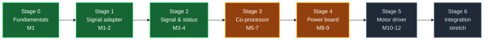

# RoverPi Custom PCB Track / 自制电路板路线图

A twelve-month plan to design the rover's own electronics from scratch, starting
from zero PCB experience. It runs as two parallel tracks: seven hardware stages,
and [a firmware track](#c-track) that starts in month 1 on a breadboard Pico
rather than waiting for the board that will need it.

一份为期约十二个月的计划，目标是从零基础开始，逐步把这台车的电子部分换成自己设计的
电路板。它由两条并行的线组成：**七个硬件阶段**，以及一条[固件线](#c-track)——后者从
第 1 个月起就在面包板上的 Pico 上跑，而不是等到需要它的那块板子出现。

> [!IMPORTANT]
> RoverSpine is a **parallel track** to the rover itself, not a replacement for the
> [RoverPi roadmap](https://github.com/AndyChen227/RoverPi/blob/main/docs/roadmap.md). The rover's autonomy phases and this hardware
> track advance independently and meet at Stage 3, where the encoder
> co-processor unblocks Phase 2.
>
> RoverSpine 这条线和[主路线图](https://github.com/AndyChen227/RoverPi/blob/main/docs/roadmap.md)是**并行**的，不是替代关系。两条线在第 3
> 阶段交汇——编码器协处理器是主路线图第 2 阶段的前置条件。

> [!NOTE]
> **Revised 2026-09-12.** Two decisions changed the shape of this plan, and both
> are recorded in [the devlog](devlog/2026-09-12-plan-revision.md):
>
> 1. **The first board is the passive signal adapter, not the status HAT.** The
>    stages were renumbered, and the status indicator functions were merged into
>    Stage 2. See [Stage 1](#stage-1).
> 2. **The firmware language is no longer decided.** The earlier commitment to C
>    was made from reading, not from writing code. It is now an explicit
>    end-of-month-1 decision made from a measurement. See
>    [the firmware track](#c-track).
>
> Later the same day, two factual errors in the Stage 1 specification were found
> and corrected — the D50A's `V` pins **must** be connected to 3.3 V, and the
> board carries 10 connections rather than 7. See
> [that devlog](devlog/2026-09-12-d50a-control-header-correction.md).
>
> **同一天稍后**又发现并更正了第 1 阶段规格里的两个事实错误：D50A 的 `V` 脚**必须**接
> 3.3 V，而这块板是 10 个连接不是 7 个。见[那篇更正](devlog/2026-09-12-d50a-control-header-correction.md)。
>
> Later again the same day, the twelve reserved resistors were found to be
> specified but **absent from the schematic**, and the line saying all twelve
> pads could ship empty was found to be wrong — six of them are in the signal
> path. The net structure that results is now
> [written down as a table](#nets). See
> [that devlog](devlog/2026-09-12-reserved-resistor-pads.md).
>
> **再稍后**发现那 12 个预留电阻**只写在规格里、没有画进原理图**，而且"12 个焊盘都可以
> 先不焊"这句话是错的——其中 6 个在信号路径上。由此产生的网络结构现在[列成了一张表](#nets)。
> 见[那篇记录](devlog/2026-09-12-reserved-resistor-pads.md)。
>
> **2026-09-12 修订。** 有两个决定改变了这份计划的形状，都记录在[开发日志](devlog/2026-09-12-plan-revision.md)里：
> **(1)** 第一块板改成被动信号转接板，不是状态指示板，阶段重新编号，状态指示功能合并进
> 第 2 阶段；**(2)** 固件语言不再预先决定——之前定 C 是"读来的判断"而不是"写出来的结论"，
> 现在改成第 1 个月末根据实测做决定。

---

## The one rule / 唯一的铁律

**The rover must be drivable at the end of every session.**

Every stage keeps the part it replaces. A new board is installed only after it
has passed its own bring-up on the bench, and the old part goes into a labeled
bag, not into the bin. If a board fails on the floor, the fallback is a
five-minute swap, not a redesign.

This is the same principle the software side already follows: a capability is
claimed only after it has been physically verified, and nothing verified is
thrown away to make room for something unverified.

**每次收工时，车必须是能开的。**

每一个阶段都保留它所替换的那个部件。新板子只有在台面上完成单独的上电测试之后
才允许装车，被换下来的旧件装进贴好标签的袋子，不扔。板子在地面上出问题时，退
路是五分钟换回去，而不是重新设计。

这和软件那边的规矩是同一条：功能只有实测通过才能算数，已经验证过的东西不为了
给未验证的东西腾位置而丢掉。

---

<a id="mechanical"></a>

## The mechanical constraint: no HATs / 机械约束：不做 HAT

**Established 2026-09-11.** The Raspberry Pi 5 sits on the rover's upper deck and
already carries an active cooler, so **nothing can be stacked on its 40-pin
header.** This is a physical fact about the vehicle, and it applies to every board
in this plan.

So every RoverSpine board is a **separate board in its own small enclosure**,
connected by ribbon cable — not a HAT:

```text
Raspberry Pi 5 (upper deck, active cooler on top)
    │  2×20, 40-pin female-to-female ribbon, 10–15 cm
    ▼
RoverSpine board (upper deck, in an enclosure, double-sided tape)
    │  ribbon cables out to whatever this board serves
    ▼
Driver / encoders / sensors (lower deck and chassis corners)
```

This costs one extra cable and buys three things: the cooler keeps working, the
board can be any size and shape the circuit wants, and a failed board is
unplugged rather than unbolted.

**2026-09-11 确定。** 树莓派 5 在第二层，上方已经装了主动散热器，所以**它的 40 针
排针上不能再叠任何东西**。这是车的物理事实，对这份计划里的每一块板都成立。

因此 RoverSpine 的每一块板都是**装在自己小外壳里的独立板**，用排线连接，而不是 HAT。
代价是多一条排线，换来三件事：散热器继续工作、板子的尺寸和形状可以完全按电路需要来定、
坏板子是拔下来而不是拆下来。

---

## What the board can replace / 这块板能替换什么

| # | Current part | 现有部件 | Replaceable? | Stage | Note |
|---:|---|---|:---:|:---:|---|
| 1 | Raspberry Pi 5 | 树莓派 5 | ❌ No | — | Keep it. Replacing it is a different project, not an upgrade to this one |
| 2 | 10 dupont control wires | 10 根杜邦控制线 | ✅ Yes | **1** | The easiest and highest-safety-value win. Also removes the 3.3 V / 5 V mis-plug hazard — see [Stage 1](#stage-1) |
| 3 | CH9102F USB serial adapter | USB 转串口模块 | ✅ Yes | 3 | The lidar UART goes to the on-board MCU instead |
| 4 | USB power bank | 充电宝 | ✅ Yes | 4 | Needs a 5 V / 5 A buck. The riskiest replacement |
| 5 | WHEELTEC motor driver | 电机驱动板 | ✅ Yes | 5 | The graduation project. May slip past month 12 |
| 6 | Inline fuse | 保险丝 | ⚠️ Partly | 5 | Add electronic current limiting, but **keep the physical fuse** |
| 7 | Main power switch | 总开关 | ❌ Never | — | A physical cutoff must never depend on any board working |

第 1 项和第 7 项永远不换：主控换掉等于重开一个项目；物理断电开关的全部价值就在于
它不依赖任何电路正常工作。第 6 项只做增强不做替换——电子限流会失效，保险丝不会。

## What the board can add / 这块板能增加什么

These are the things you cannot buy as a module and cannot do in software.
每一项都是买不到现成模块、或者软件根本做不到的。

| Function | 功能 | Why it needs hardware | Stage |
|---|---|---|:---:|
| Safe state at power-on | 上电默认安全状态 | Between Pi power-on and the script starting, GPIO states are undefined. Pull-downs make "unattended" mean "stopped" — and no Python can reach this, because the Python is not running yet | **1** |
| Keyed connectors, strain relief | 带锁扣连接器与拉力缓解 | A dupont wire falling off mid-drive is undefined behavior | **1** |
| Status LEDs and buzzer | 状态灯与蜂鸣器 | Directly serves the "run without SSH" goal — you need to see the state without a terminal | **2** |
| Heartbeat watchdog | 心跳看门狗 | If the Pi hangs, Python cannot stop anything. The last PWM value stays applied and the rover keeps driving | 3 |
| Quadrature decoding | 正交解码 | ~7000 counts/s per wheel × 4 wheels at full speed. Python will silently drop counts | 3 |
| Battery voltage monitor | 电池电压监测 | **The Pi 5 has no ADC at all.** A 3S LiPo below 9.9 V is permanent damage, and right now nothing is watching | 3 |
| Physical E-stop input | 物理急停输入 | A button that cuts drive without going through software | 3 |
| Bumper / cliff switch inputs | 碰撞与跌落开关输入 | Covers exactly what the ≤2 mm lidar beam cannot see | 3 |
| Servo header | 舵机接口 | For the Phase 4 lidar sweep, already in the main roadmap | 3 |
| IMU footprint | IMU 焊盘 | Phase 4, decided from the Phase 3 square-test heading error | 3 |
| Motor current sensing | 电机电流采样 | Stall detection, and a real over-current trip. Also the only honest way to know how hard the rover is working | 5 |

---

<a id="menu"></a>

## Capability menu / 可选功能清单

The stages below are the plan of record. This section is the **menu they were
chosen from**, kept so that later scope changes are made from a full list rather
than from whatever is easiest to remember. Ranked by value per unit of
difficulty, not by date.

下面的阶段划分是**当前执行计划**；这一节是这些阶段**从里面挑出来的菜单**，保留它的目的
是：以后改计划时，是从一张完整的清单上挑，而不是从"当时最容易想起来的那几个"里挑。
按"每一分难度换来多少价值"排序，不按时间排。

### Tier A — high value, low difficulty / A 档：高价值、低难度

| Function | 功能 | How | 难度 | Stage |
|---|---|---|:---:|:---:|
| Replace the 10 dupont wires | 替换 10 根杜邦线 | Passive adapter board, keyed boxed headers | ⭐ | 1 |
| **Safe state at power-on** | **上电默认安全状态** | 6 pull-down resistors on the driver inputs | ⭐ | 1 |
| Series protection resistors | 信号串联保护电阻 | 33 Ω in series on every Pi-facing signal | ⭐ | 1 |
| **Physical E-stop button** | **物理急停按钮** | Button in series with the driver enable path | ⭐ | 3 |
| Status LEDs, buzzer, button | 状态灯、蜂鸣器、按钮 | GPIO + current-limiting resistors | ⭐ | 2 |
| Encoder interface | 编码器接口 | Connectors + pull-ups (**measure the level first**) | ⭐⭐ | 2 |
| Regulated sensor supply | 传感器统一稳压供电 | Off-the-shelf LDO or buck module | ⭐ | 2 |
| Test points, silkscreen, spare pads | 测试点、丝印、备用引出 | Free at draw time; impossible after fabrication | ⭐ | all |

### Tier B — high value, medium difficulty / B 档：高价值、中难度

Note the "firmware?" column. **Most of these do not need a microcontroller** —
an off-the-shelf I2C part plus the Pi's existing Python gets you there.

注意"需要固件"那一列：**这里大部分功能并不需要单片机**，一颗现成的 I2C 芯片加上 Pi 上
已经写好的 Python 就够了。

| Function | 功能 | How | Firmware? | 难度 | Stage |
|---|---|---|:---:|:---:|:---:|
| **Battery voltage monitor** | **电池电压监测** | Divider + ADS1115 (I2C 16-bit ADC, ≈¥10), read from Python | ❌ | ⭐⭐ | 3 |
| **Current monitor** | **电流监测** | INA226 / INA219 (I2C current+power monitor) + shunt | ❌ | ⭐⭐ | 3 / 5 |
| **Heartbeat watchdog** | **心跳看门狗** | **Pure hardware:** Pi toggles a pin → retriggerable monostable (CD4538) or a dedicated watchdog IC (TPS3813 / MAX6369) → enable pulled low when the toggling stops | ❌ | ⭐⭐⭐ | 3 |
| IMU (heading) | IMU（航向角） | MPU6050 / ICM-42688 module on I2C | ❌ | ⭐⭐ | 3+ |
| Bumper switches | 碰撞开关 | Microswitch + pull-up + series resistor | ❌ | ⭐ | 3 |
| Cliff / drop detection | 跌落检测 | Reflective IR sensor | ❌ | ⭐⭐ | 3+ |
| Ultrasonic range | 超声波测距 | HC-SR04 class module — covers the lidar's blind spot | ❌ | ⭐⭐ | 3+ |
| Lidar UART onto the board | 激光 UART 直接进板 | On-board USB-UART, retires the CH9102F | ❌ | ⭐⭐⭐ | 3 |
| **4-channel quadrature decode** | **四路硬件正交解码** | RP2040 PIO | ✅ **required** | ⭐⭐⭐⭐ | 3 |

### Tier C — hard, and the real craft / C 档：难，也是真本事

| Function | 功能 | The hard part | 难度 | Stage |
|---|---|---|:---:|:---:|
| Power board 11.1 V → 5 V / 5 A | 电源板 | Switching layout. Where beginners destroy hardware. **Never first-power it into the Pi** | ⭐⭐⭐⭐ | 4 |
| 4-channel H-bridge driver | 自制四路 H 桥 | Power, thermals, copper width, dead time. Integrated H-bridge ICs, not discrete MOSFETs | ⭐⭐⭐⭐⭐ | 5 |
| Over-current / stall cutoff | 过流 / 堵转切断 | Current sense into a fast comparator cutoff | ⭐⭐⭐⭐ | 5 |
| Four-layer mainboard | 四层主板整合 | Layout craft and manufacturability; bare RP2040 instead of a module | ⭐⭐⭐⭐⭐ | 6 |

### The observation that shapes this plan / 一个决定计划形状的观察

Read the "firmware?" column in Tier B again. **The microcontroller has exactly
one irreplaceable job in this project: four-channel high-speed quadrature
decode** (~28 000 edges/s across four wheels at full speed, which Python drops
silently). Everything else has a no-firmware path:

- battery voltage → an I2C ADC, read from Python;
- current → an I2C current monitor, read from Python;
- **the heartbeat watchdog → pure analog is actually *better***, because it has no
  firmware that can crash. A watchdog running on a microcontroller raises the
  question of what happens when *that* hangs.

Two consequences, both deliberate:

1. **Tier A and most of Tier B can be reached without writing a single line of
   firmware.** That is already a rover with power-on safety, an E-stop, battery
   and current monitoring, status indication, heading, and bump detection.
2. **The firmware language decision therefore carries less weight than it
   feels like it does.** It governs one board, and that board is months away.

把 B 档"需要固件"那一列再看一遍：**单片机在这个项目里只有一个真正不可替代的用途——
四路高速正交解码**（满速四轮约 28000 边沿/秒，Python 会悄无声息地丢计数）。其余功能都有
"不写固件"的路：电压和电流用 I2C 芯片 + Python 读；**心跳看门狗用纯模拟电路反而更可靠**，
因为它没有固件可以崩溃——跑在单片机上的看门狗，那颗单片机自己死机了怎么办？

两个结论，都是有意的：**(1)** A 档和 B 档的大半，可以在一行固件都不写的情况下拿到手，
那已经是一台有上电安全、急停、电压电流监测、状态显示、航向和碰撞检测的车；
**(2)** 因此**固件语言这个决定的分量比它感觉上的要小**——它只管一块板，而那块板还很远。

---

<a id="c-track"></a>

## The parallel firmware track / 并行的固件线

### The language is not decided / 语言尚未决定

**Revised 2026-09-12.** An earlier version of this document committed to **C** on
the Raspberry Pi Pico SDK, dated 2026-09-08. That commitment is withdrawn — not
because C was the wrong answer, but because **it was decided from reading rather
than from writing code.** `firmware/` was empty and no Pico had been bought. By
this repository's own rule, a value fixed before the measurement is a guess
wearing a footprint.

**The decision is now an explicit end-of-month-1 deliverable, made from a
measurement.** See [the evaluation](#lang-eval) below.

**2026-09-12 修订。** 本文档早先的版本在 2026-09-08 定下用 **C** + Pico SDK。这个决定
现在撤回——不是因为 C 是错的答案，而是因为**它是读出来的判断，不是写出来的结论**：当时
`firmware/` 是空的，Pico 也还没买。按这个仓库自己的规矩，测量之前定下来的数值，只是一个
套着封装的猜测。**现在它变成第 1 个月末的一个明确产出，根据实测来定。**

### One fact to settle first: C++ is not the easier one / 先说清一个事实：C++ 不是更简单的那个

This is recorded here so it does not have to be re-argued later.

**C++ is a superset of C.** Everything that makes C feel tedious is still
present in C++ — pointers, memory layout, `uint8_t`, bit manipulation, manual
resource handling. C++ adds a layer on top of that, and on a microcontroller
most of the features that make C++ feel convenient are unavailable:

| Familiar from Java | On an RP2040 |
|---|---|
| `std::string` / `std::vector` | Need the heap; normally banned in embedded |
| `try` / `catch` | Disabled; the Pico SDK does not enable exceptions by default |
| RTTI / `dynamic_cast` | Disabled |
| `new` / `delete` | Fragments memory over a long run; banned |

So embedded C++ means learning all of C **plus** carrying a list of C++ features
that must not be used. C++ is a legitimate choice, but it is not the shortcut.

**What is actually painful is usually not the language.** It is CMake,
`pico_sdk_import.cmake`, environment variables, dragging a `.uf2` onto a drive,
no REPL, a crash that presents as a silent hang, and `printf` needing
`stdio_init_all()` and a configured UART first. **None of that changes if you
switch language.** It changes if you switch *framework*.

这一节写在这里，是为了以后不用再争一遍。**C++ 是 C 的超集**：C 里让人觉得麻烦的东西
（指针、内存布局、定长整数、位运算、手动管理资源）在 C++ 里一个都不会消失，C++ 只是
在上面再加一层；而在单片机上，C++ 里那些让它显得好用的东西（`std::string`、`std::vector`、
异常、RTTI、`new`/`delete`）基本都用不了。所以嵌入式 C++ 的实际处境是：**既要学 C 的全部，
又要额外背一张"这些不能用"的清单。** C++ 是一个正当的选择，但它不是捷径。

**真正折磨人的通常不是语言，而是工具链**：CMake、环境变量、拖 `.uf2`、没有 REPL、
崩溃表现为静默死机、`printf` 之前还要先初始化串口。换语言这些一样痛，换**框架**才有用。

<a id="lang-eval"></a>

### The month-1 evaluation / 第 1 个月的评估

Buy two Raspberry Pi Picos (≈¥25 each) and write **the same blink program** in
each candidate. The Pico carries the same chip that goes on the Stage 3 board
but needs **no PCB at all**, so this costs ¥50 and no schedule.

| Candidate | 候选 | What it gives | What it costs |
|---|---|---|---|
| **C** on the Pico SDK | 原生 Pico SDK 的 C | The language every chip datasheet's reference code is written in. Teaches exactly what register-level work consists of | CMake and the steepest toolchain of the three |
| **C++** on arduino-pico | arduino-pico 的 C++ | It *is* C++, as requested. No CMake, `setup()`/`loop()`, `pinMode()`, one-click upload, `Serial.println()` that just works. Exposes PIO, so Stage 3's quadrature decode is still reachable | You still need to *read* C, because the vendor examples are C |
| **MicroPython** | MicroPython | A REPL. Change a line, see it immediately. The honest "I want this to be easy" answer | Every vendor example has to be translated by hand; high-speed work has to go through PIO |

**The criterion is not which one looks nicer.** It is: *after finishing blink,
which one makes you want to write a second program?* That is the only measurement
that predicts whether the Stage 3 firmware gets finished.

买两块 Pico（每块约 ¥25），用每个候选**写同一个 blink**。Pico 上的芯片和第 3 阶段板上
要用的是同一颗，但它是成品小板，**完全不需要 PCB**——所以这件事花 ¥50，不占进度。

**判据不是"哪个看起来更顺眼"**，而是：**写完 blink 之后，哪一个让你想写第二个程序。**
这是唯一能预测第 3 阶段固件会不会真的做完的测量。

> [!TIP]
> **Buy two Picos, not one.** The second, flashed with `debugprobe` firmware,
> becomes an SWD debugger for the first. Embedded code has no REPL (except
> MicroPython) and a crash is often a silent hang, so having a debugger and not
> having one are two different worlds. Extra cost: about ¥25.
>
> **买两块 Pico，不是一块。** 第二块刷上 `debugprobe` 固件，就是第一块的 SWD 调试器。
> 嵌入式代码没有 REPL（MicroPython 除外），崩溃往往表现为静默死机——有调试器和没调试器
> 是两个世界。多花约 ¥25。

### Learn it in parallel, not at Stage 3 / 并行学，不要等到第 3 阶段

This part of the original plan is unchanged, and it is the most important
scheduling decision in the document. Running the firmware track from month 1 on a
breadboard Pico turns two serial learning curves into two parallel ones:

原计划的这一部分不变，而它是整份文档里最重要的排期决策。从第 1 个月起就在面包板上的
Pico 上跑固件线，把两条串行的学习曲线变成并行的：

| Month / 月份 | Hardware track / 硬件线 | Firmware track / 固件线 |
|:---:|---|---|
| 1 | Soldering, KiCad, Stage 1 schematic / 焊接、KiCad、第 1 阶段原理图 | **Blink, written in every candidate. Decide the language at month end** / 用每个候选各写一遍 blink，月末定语言 |
| 1–2 | Stage 1 adapter board / 转接板 | Language basics in whichever won / 用选定的语言打基础 |
| 3–4 | Stage 2 signal & status board / 信号与状态板 | PIO quadrature decode and UART, on a breadboard / 面包板上试 PIO 正交解码与 UART |
| 5–7 | Stage 3 board / 协处理器板 | **The firmware already exists and has run** / 固件早已写好并跑通 |

The point is what this does to Stage 3's risk. It stops being "a new board and a
new language and a new architecture, all at once" and becomes "move firmware that
already works onto a board of my own." That is the same rule the rest of this
plan follows: prove it somewhere reversible first, then commit it to copper.

这样做的意义在于第 3 阶段的风险。它不再是"同时面对新板子、新语言、新架构"，而变成
"把一个已经跑通的固件搬到自己的板上"。这和本计划其余部分是同一条规矩：**先在可回退
的环境里验证，再固化到铜箔上。**

### Where the firmware track is not used / 固件线不用在哪

The Pi-side control code stays in Python. It is already written and already
physically verified, and rewriting it would mean discarding verified work to
make room for unverified work — which the one rule above forbids. The firmware
track belongs on the on-board microcontroller, which is its actual territory.

Pi 端的控制代码继续用 Python。它已经写好、也已经实测验证过，重写等于丢掉已验证
的东西去换未验证的东西——这正是上面那条铁律所禁止的。固件线用在板载单片机上，那才是
它真正的地盘。

---

## Tools and budget / 工具与预算

Buy Stage 0 and Stage 1 tools now; defer the rest until the stage that needs them.
The full inventory — what is owned, ordered, and still to buy, with a running
total — lives in [`tools-and-parts.md`](tools-and-parts.md). How a finished
project becomes a physical board is in [`fabrication.md`](fabrication.md).

第 0、1 阶段的工具现在就买，其余的等到需要的阶段再买。实际选定了什么，按日期记在
[`tools-and-parts.md`](tools-and-parts.md)。

| Tool | 工具 | Approx. ¥ | Needed from |
|---|---|---:|:---:|
| Temperature-controlled iron (T12 / 936) | 恒温烙铁 | 150–300 | Stage 0 |
| Multimeter | 万用表 | 100–200 | Stage 0 |
| Solder, flux, wick, tweezers, cutters | 焊锡、助焊剂、吸锡带、镊子、斜口钳 | 80 | Stage 0 |
| **2 × Raspberry Pi Pico** | **树莓派 Pico ×2** | 50 | Stage 0 — for [the language evaluation](#lang-eval) |
| Breadboard and jumper wires | 面包板与跳线 | 30 | Stage 0 |
| Ribbon cables (2×20 and 2×5, F-F) | 排线（2×20 与 2×5 母对母） | 20 | Stage 1 |
| **Bench supply with current limit** | **带限流的可调直流电源** | 200–400 | Stage 2 |
| USB logic analyzer (8 ch) | USB 逻辑分析仪 | 30–80 | Stage 3 |
| Hot air station | 热风枪 | 200 | Stage 3 |
| Entry digital oscilloscope | 入门数字示波器 | 800+ | Stage 4 |
| PCB fabrication, all stages | 打样，全部阶段 | 400–800 | — |
| Components, all stages | 元件，全部阶段 | 300–600 | — |

**Year total: roughly ¥2000–3000.** 全年大约两三千。

> [!TIP]
> The current-limited bench supply is the single best purchase on this list.
> Set the limit to 100 mA, power a new board for the first time, and a short
> circuit becomes a reading on a display instead of a dead board and a
> burnt trace. Never first-power a board you designed from a battery.
>
> Stage 1 is passive copper with no power input of its own, so the supply is not
> needed until Stage 2 — but buy it before the first board that draws current.
>
> 带限流的电源是这张表上最值得买的一件。限流设到 100 mA 给新板第一次上电，短路
> 就只是显示屏上的一个数字，而不是一块废板加一道烧断的铜箔。**自己设计的板子，
> 第一次上电永远不要用电池。** 第 1 阶段是纯被动铜板、自己不取电，所以这件可以等到
> 第 2 阶段——但一定要在第一块真正吃电的板子之前买到。

---

## Stage 0 — Fundamentals, no PCB / 基本功，先不做板

**Month 1, weeks 1–3 / 第 1 个月前三周**

The mistake almost everyone makes is ordering a board before they can solder or
read a datasheet. Nothing is fabricated in this stage.

**Hardware / 硬件线**

- [ ] Solder 30–50 practice joints on a cheap practice kit until they are consistently shiny and concave.
- [ ] Learn the multimeter: continuity, resistance, DC voltage, and **diode mode for finding shorts**.
- [x] Install KiCad. *(10.0.6, 2026-09-08.)* Work through one official beginner tutorial end to end.
- [ ] **Redraw something that already exists**: capture the rover's current 10-wire Pi-to-driver connection as a KiCad schematic, using [`RoverPi/docs/wiring.md`](https://github.com/AndyChen227/RoverPi/blob/main/docs/wiring.md) as the source. Draw it from the **physical pin numbers**, not the BCM numbers — they are different, and a board built from the wrong column is simply wrong. No layout, no fabrication. *(This exercise became [Stage 1](#stage-1) — the same drawing, taken all the way to a fabricated board.)*
- [ ] Read the datasheet of one part you already own (the motor driver, or the STP-23L) and find in it: supply range, logic thresholds, absolute maximum ratings.

**Firmware / 固件线**

- [ ] Buy two Raspberry Pi Picos and a breadboard.
- [ ] Install the toolchain for **each** candidate and build `blink` unmodified until it flashes, in each one.
- [ ] Modify `blink` until the LED pattern is one you chose. **This is the whole first milestone** — the point is a working edit-build-flash loop, not clever code.
- [ ] Flash the second Pico with `debugprobe` firmware and step through a line of code on the first.
- [ ] **Decide the language** and record the decision, with the reason, in a devlog entry. See [the evaluation](#lang-eval).

**Exit criterion / 完成判据:** you can produce a solder joint you are willing to
put on a moving vehicle; you can point at any pin in your KiCad schematic and say
which physical wire it is on the rover; you can change one line of code, build
it, flash it, and see the change on the Pico; and **the language question is
closed, with a written reason.**

这个阶段不做任何板子。绝大多数人的第一个错误是在还不会焊接、看不懂数据手册的时候
就下单打样。用 KiCad **重画一份已经存在的东西**（现有的 10 根控制线）是最好的入门
练习——因为对错可以立刻验证，你的车就是标准答案。**注意用物理引脚号而不是 BCM 号**，
两者不同，照错的那一列做出来的板子就是错的。（这个练习后来变成了[第 1 阶段](#stage-1)：
同一张图，一路画到真板子。）

固件线的第一个里程碑是**改一行代码、编译、烧录、看到变化**——重点是打通这个循环，
不是写出聪明的代码。这个循环通了，后面所有固件工作才有立足点。这个阶段还要**把语言
问题关掉**，并且把理由写进开发日志。

---

<a id="stage-1"></a>

## Stage 1 — First board: passive signal adapter / 第一块板：被动信号转接板

**Months 1–2 / 第 1–2 个月** · Planning devlog:
[2026-09-11](devlog/2026-09-11-signal-adapter-planning.md)

The first board must be **too simple to fail** in an interesting way. Its purpose
is to teach the whole pipeline — schematic, footprint, layout, DRC, Gerber,
ordering, soldering, bring-up, installation — not to teach circuit design.

A passive adapter is a better first board than the status indicator it replaced
in the plan, for four reasons:

1. **Passive. Nothing on it can burn.** Safer than a board that drives LEDs
   from Pi GPIO. *Amended 2026-09-12: this originally read "pure copper, not
   one component can burn". Half of that stopped being true when the six
   series resistors became mandatory parts — the board is no longer
   component-free. Nothing on it can still burn, since a 33 Ω resistor
   passing a GPIO's few milliamps is not a thermal event, but "passive" and
   "component-free" are two different claims and only the first survives.
   See [that devlog](devlog/2026-09-12-reserved-resistor-pads.md).*
2. It still teaches the **entire** pipeline end to end.
3. It replaces a real failure mode — vibration works a dupont jumper loose, and a
   detached direction pin is undefined motor behavior — so it is not a practice
   piece.
4. The fallback is **five minutes**: unplug the ribbon, put the dupont wires back.

第一块板必须**简单到出不了有意思的错**。它教的是完整流程，不是电路设计。被动转接板
比原计划里的状态指示板更适合当第一块：纯铜，没有一个元件会烧，比用 Pi 的 GPIO 驱动
LED 更安全；但它教的仍然是完整的一条流水线；它替换的是真实失效（振动使杜邦线松脱，
方向线一旦脱落，电机行为未定义），所以不是练习品；而且退路只要五分钟——拔掉排线，把
杜邦线插回去。

### Specification — Rev A / 规格

Rev A is deliberately minimal. See the
[planning devlog](devlog/2026-09-11-signal-adapter-planning.md) for the full
reasoning.

- Two-layer board, small, in its own enclosure — **not a HAT**, see [the mechanical constraint](#mechanical)
- **Through-hole as built.** The 6 series resistors are **through-hole axial parts, and they must be populated** — they sit in the signal path, so an empty series pad is an open signal and a dead board. The 6 pull-downs are the only genuinely optional parts, and they are 0805 pads Rev A may ship empty. *Corrected 2026-09-12: an earlier version of this line said all twelve pads could ship empty. Six of them cannot — see [that devlog](devlog/2026-09-12-reserved-resistor-pads.md).*
- 1 × 2×20 (40-pin) connector to the Pi, via a 10–15 cm female-to-female ribbon
- 1 × **2×5 boxed header (`DC3-10P`)** to the D50A, via a ≈35 cm female-to-female ribbon. **Boxed, not plain** — the D50A's own control header is shrouded, so a matching boxed header makes both ends keyed and the ribbon orientation a single solution
- **10 connections to the D50A, forming 14 nets:** 6 motor-control signals, `GND` (two pins), `+3V3` (two pins). The six signals are **no longer bare copper end to end** — each passes through a series resistor, which splits it into a Pi-side net and a driver-side net. `GND` and `+3V3` stay direct copper. See [the net structure](#nets)
- Readable silkscreen labels on every signal. **Use the D50A's own short-form names at J2** — `V` `P1` `A1` `B1` `G` — because that is the end it plugs into; the Pi-side names stay `PWM1` / `INA1` / … as used in RoverPi's `wiring.md`
- No microcontroller, no firmware, no battery input, no regulator, no motor power
- Test points on every signal

> [!CAUTION]
> **`V` is a 3.3 V input, and 5 V will damage it.** On the Pi header, 3.3 V is
> physical pins 1 and 17; 5 V is pins 2 and 4, one row over and immediately
> adjacent. The `+3V3` net on this board must originate **only** at pins 1 and 17.
>
> This is the single highest-value thing the board buys. A dupont wire can be
> moved onto pin 2 by mistake in a second, and 5 V into a 3.3 V isolated input is
> a damaged part, not a stall. A copper trace cannot be mis-plugged at all, so the
> failure mode disappears permanently. See
> [the correction devlog](devlog/2026-09-12-d50a-control-header-correction.md).
>
> **`V` 是 3.3 V 输入，5 V 会烧掉它。** 树莓派排针上 3.3 V 是 1 号和 17 号针，而 5 V 是
> 2 号和 4 号针，就在隔壁一排紧挨着。板上的 `+3V3` 网络**只能**来自 1 号和 17 号针。
>
> 这是这块板买到的最有价值的一样东西：杜邦线一秒钟就能插错到 2 号针上，而 5 V 灌进 3.3 V
> 隔离输入是**烧器件**，不是停车。铜箔根本无法插错，这个失效模式永久消失。

### Two nearly-free additions / 两个几乎不花钱的增补

Both were raised on 2026-09-12. They cost no board area worth counting and
cannot be added after fabrication.

| Addition | 增补 | Why |
|---|---|---|
| **Connect both GND positions** | **两个 GND 都接** | The D50A header has two GND pins. Connecting one means the return current for all six signals goes through a single IDC contact. If that contact opens, return current finds a path through the signal pins — which is the same class of failure this board exists to remove. The second GND pin already exists; using it costs nothing |
| **6 series resistors (through-hole, populated) + 6 pull-down pads (0805, may ship empty)** | **6 个串阻（通孔，必焊）+ 6 个下拉焊盘（0805，可以先不焊）** | Pull-downs make the driver inputs low while Pi GPIO is high-impedance, so the window between Pi power-on and the Python starting means **stopped** instead of undefined. This is the cheapest safety feature in the whole plan. Series resistors are cheap insurance against a wiring mistake — but they are **in the signal path, so they are not optional**: an empty series pad is an open signal. Reserving the pull-down pads is free; adding either later costs a fabrication run |

> [!NOTE]
> Reserving unpopulated pads is the same principle as
> [section 4 of the README](../README.md#functions) — headers and footprints
> cost almost nothing to add and cannot be added after the board is fabricated.
>
> 留空焊盘和 README 第 4 节"为以后预留"是同一条原则：排针和焊盘加上去几乎不花钱，
> 但板子做出来之后就再也加不了。

### Gating checks — before footprints are frozen / 锁封装前必须先做

- [ ] The cables have arrived, and both are confirmed **female-to-female**.
- [ ] Pitch confirmed as 2.54 mm, and the socket confirmed to mate with a boxed header.
- [ ] **Which physical D50A pin is pin 1 — resolved, not assumed.** Both ends are keyed, so only one orientation is possible: plug the ribbon onto the D50A and find by continuity which conductor reaches each signal. `G` is continuous with the motor-power negative (`P-`), which cross-checks the map. **This is the one unknown that can silently swap `PWM1` onto the driver's `P2` input and drive the wrong motors.**
- [ ] Pin 1 / red-stripe direction identified at **both ends of both cables**.
- [ ] Continuity checked pin by pin with a multimeter, **before either cable touches the rover**.
- [ ] Connector body size and clearance checked against the intended enclosure — a boxed header is taller than plain pins.

**Only then** assign final footprints and start layout. As of 2026-09-12 the
cables have not arrived.

### Confirmed signal map / 已确认信号表

**Source:** RoverPi's D50A control-header wiring table. Corrected 2026-09-12 —
the earlier 7-row version omitted both `V` pins and the second `G`. See
[the correction devlog](devlog/2026-09-12-d50a-control-header-correction.md).

**出处：** RoverPi 的 D50A 控制口接线表。2026-09-12 更正——早先那张 7 行的表漏了两个 `V`
和第二个 `G`。

| D50A silkscreen | Pi-side net | Pi physical pin | BCM / rail | Channel |
|:---:|---|---:|---|---|
| `P1` | `PWM1` | 32 | GPIO12 | 1 — left motors |
| `A1` | `INA1` | 16 | GPIO23 | 1 |
| `B1` | `INB1` | 18 | GPIO24 | 1 |
| `P2` | `PWM2` | 33 | GPIO13 | 2 — right motors |
| `A2` | `INA2` | 29 | GPIO5 | 2 |
| `B2` | `INB2` | 31 | GPIO6 | 2 |
| `G` × 2 | `GND` | 34, 39 | GND | both |
| `V` × 2 | `+3V3` | **1, 17** | **3.3 V — never 5 V** | both |

The D50A control header, as printed on the board:

| 上排 — Channel 2, right motors | `V` | `P2` | `A2` | `B2` | `G` |
|---|---|---|---|---|---|
| **下排 — Channel 1, left motors** | `V` | `P1` | `A1` | `B1` | `G` |

`V` and `G` appear twice on the header but are one net each. Both are connected
anyway: the pins already exist, so the redundant contact costs nothing and
removes the case where a single IDC contact is the only path for a whole rail.

`V` 和 `G` 在排针上各出现两次，但各自只是一个网络。两个都接——针本来就在那儿，冗余触点
不花钱，而且消除了"一整条电源全靠一个 IDC 触点"这种情况。

<a id="nets"></a>

### The net structure / 网络结构

**Decided 2026-09-12**, when the twelve reserved resistors went from a line in
the specification to parts on the drawing. See
[that devlog](devlog/2026-09-12-reserved-resistor-pads.md).

A series resistor cuts each signal in two, so this board's eight nets become
**fourteen**. **This table, not the signal map above, is what the netlist check
compares against**, and what the silkscreen is read from.

串阻把每个信号切成两段，所以这块板的 8 个网络变成 **14 个**。**网表核对比的是这张表，
不是上面那张信号表**；丝印也按这张表来。

| Pi-side net | J1 pin | Series R | Driver-side net | Pull-down | J2 pin | D50A silkscreen |
|---|---:|---|---|---|---:|:---:|
| `PWM1` | 32 | R1 33 Ω | `P1` | R7 10 kΩ → `GND` | 7 | `P1` |
| `INA1` | 16 | R2 33 Ω | `A1` | R8 10 kΩ → `GND` | 5 | `A1` |
| `INB1` | 18 | R3 33 Ω | `B1` | R9 10 kΩ → `GND` | 3 | `B1` |
| `PWM2` | 33 | R4 33 Ω | `P2` | R10 10 kΩ → `GND` | 8 | `P2` |
| `INA2` | 29 | R5 33 Ω | `A2` | R11 10 kΩ → `GND` | 6 | `A2` |
| `INB2` | 31 | R6 33 Ω | `B2` | R12 10 kΩ → `GND` | 4 | `B2` |
| `GND` | 34, 39 | — | — | — | 1, 2 | `G` |
| `+3V3` | 1, 17 | — | — | — | 9, 10 | `V` |

Three decisions are inside that table, and none of them is arbitrary.

这张表里藏了三个决定，没有一个是随手写的。

#### 1. The driver-side nets are named `P1` / `A1` / `B1`, not `PWM1_D`

This carries
[the schematic's naming rule](devlog/2026-09-12-revA-schematic-complete.md) to
its conclusion. The Pi-side net carries the name RoverPi's `wiring.md` uses; the
driver-side net carries the name printed on the D50A; J2's silkscreen is
therefore the D50A's own name with **no translation step anywhere**. The board's
whole job is to join two naming schemes — **and now the joint is a physical part
you can point at.**

这是把原理图那条"让一个字符串贯穿到底"的命名规则用到底：Pi 侧用 RoverPi `wiring.md`
的名字，驱动侧用 D50A 板上印的名字，J2 的丝印于是**全程不需要翻译**。这块板的工作
本来就是把两套命名接起来——**而现在那个接头是一个你能用手指头指得到的元件。**

#### 2. The pull-down sits on the driver side, after the series resistor

Electrically the two placements are nearly identical: the driver input is
high-impedance, so no current flows in the 33 Ω and there is no drop across it.
The reason to choose the driver side is **a failure mode**. If a series resistor
is missing, badly soldered, or its joint cracks on a moving vehicle, a
driver-side pull-down still holds the driver input low — **the safe state does
not depend on the series resistor being there.** A Pi-side pull-down leaves the
driver input floating under exactly that fault, which is undefined behaviour:
the thing this board exists to remove.

电气上两种接法几乎一样（驱动输入高阻，33 Ω 上没有电流也就没有压降）。选驱动侧的理由是
**失效模式**：万一某个串阻没装、虚焊，或者在跑着的车上焊点裂了，驱动侧的下拉**仍然**把
驱动输入按在低电平——**安全状态不依赖串阻在不在。** 下拉放 Pi 侧的话，同一个故障会让
驱动输入悬空，而那正是未定义行为，正是这块板要消除的东西。

#### 3. ERC should still report 30 errors / 0 warnings

The twelve resistors add 24 pins and **every one of them is connected**: each
Pi-side net has 2 pins, each driver-side net 3, `GND` grows from 4 pins to 10,
`+3V3` stays at 4, and no single-pin net is created. So that count is a
**prediction, not an observation** — if the report is not 30 / 0 after drawing,
something is wired wrong. It is not "the numbers moved because there are more
parts."

12 个电阻多出 24 个引脚，而且**每一个都有连接**：Pi 侧网络各 2 个引脚、驱动侧各 3 个、
`GND` 从 4 个长到 10 个、`+3V3` 仍是 4 个，没有新增单引脚网络。所以这个数字是**预测而不是
观察**——画完如果不是 30 / 0，那是接错了，**不是"元件变多所以数字就变了"**。

> [!NOTE]
> If Rev A ships with the pull-downs unpopulated, mark those six **DNP** in
> KiCad rather than writing a note in the BOM. The pads still appear on the
> board; the parts are excluded from the BOM and the placement file. The drawing
> then states the intent, and
> [the netlist check](../hardware/stage1-signal-adapter/tools/README.md) still
> sees the nets.
>
> 如果 Rev A 先不焊下拉，在 KiCad 里把那 6 个标上 **DNP**，而不是在 BOM 里写一句备注。
> 焊盘照样在板子上，元件从 BOM 和贴片坐标里排除；意图写在图上，而网表核对依然能看到这些网络。

### The direction truth table / 方向真值表

From WHEELTEC's own STM32 example (`moto.c`, v5.7):

| Action | `A` | `B` | PWM duty |
|---|:---:|:---:|---|
| Forward | high | low | 3000/7200 ≈ 42% |
| Reverse | low | high | 4000/7200 ≈ 56% |

The example's PWM runs at **10 kHz** (72 MHz / 7200).

> [!WARNING]
> **The vendor never drives both direction pins to the same level**, which is
> exactly what the reserved pull-downs do. Both-low is *expected* to mean
> "stopped" for this class of H-bridge, but it is neither documented nor
> demonstrated. **It is an assumption until measured** — see the bring-up items
> in the exit criteria.
>
> **厂家从来没有把两个方向脚驱动到同一电平**，而预留的下拉电阻做的正是"两个都低"。
> 按这类 H 桥的通行逻辑，两个都低应该是"停"，但厂家既没写进文档也没演示过。
> **实测之前它只是一个假设。**

### New skills / 新学的东西

Schematic symbols and footprints · net names · ERC · design rules · the 2-layer
ground pour · Gerber export and the 嘉立创 ordering flow (see
[`fabrication.md`](fabrication.md)) · through-hole soldering on a real board ·
ribbon-cable pin-1 discipline

### Exit criterion / 完成判据

- [ ] ERC reports **30 errors / 0 warnings**, every one of them accounted for, and **all 14 nets compared against [the net structure](#nets)** one by one — by [the checker](../hardware/stage1-signal-adapter/tools/README.md), not by reading.
- [ ] Continuity verified on the fabricated board, pin to pin, against the same table — before it touches the Pi.
- [ ] **Pi-side to driver-side now reads ≈33 Ω, not 0 Ω** — the series resistor is in the path. Read the *value*; do not just listen for the buzzer. 0 Ω means a bridged resistor or a shorted pad, and an open means a missing one.
- [ ] **Each pull-down measured from its driver-side net to `GND`:** ≈10 kΩ if populated, open if deliberately left empty. Either is fine; a value that is neither is a fault.
- [ ] **`+3V3` verified to reach `V` from Pi pins 1 and 17 only**, and verified *not* continuous with Pi pins 2 or 4.
- [ ] **Current drawn by the D50A's isolated side from the Pi's 3.3 V rail, measured and recorded.** Expected small, but the Pi's rail is paying for it, so it gets a number rather than an assumption.
- [ ] **Wheels lifted: hold both direction pins low, apply PWM, confirm the motor does not turn.** This tests the pull-down safe-state assumption. If both-low is not "stopped", the pull-down plan is redesigned before Rev B.
- [ ] All seven previously verified movement tests re-run through this board, **wheels lifted**, with results identical to the dupont-wire era.
- [ ] Then the ground driving test, re-run.
- [ ] The dupont wires bagged and labeled, not discarded.
- [ ] A devlog entry recording what was wrong with the board, because something will be.

**Cost / 成本:** ≈ ¥40–60 including cables. **Expect a Rev B.** 预计要改一版。

---

## Stage 2 — Signal & status board / 信号与状态板

**Months 3–4 / 第 3–4 个月**

This stage merges two boards that were separate in the original plan: the status
indicator HAT (originally Stage 1) and the encoder signal board (originally
Stage 2). They were merged on 2026-09-12 because the original Stage 2 already
specified "everything from Stage 1 carried forward" — so building them
separately meant fabricating the status functions twice.

It is a **functional superset of Stage 1**. When it goes on the rover, the Stage 1
adapter comes off and goes into a labeled bag as the five-minute fallback. It is
not thrown away, and it is not overwritten — Stage 1's board and files stay
exactly where they are.

这个阶段把原计划里两块分开的板合成一块：原第 1 阶段的状态指示板，和原第 2 阶段的编码器
信号板。合并的理由是原第 2 阶段的规格里本来就写着"第 1 阶段的东西全部继承过来"，分开做
等于把状态指示部分打样两次。

它是**第 1 阶段的功能超集**。它装车的时候，第 1 阶段的转接板拆下来、装进贴好标签的袋子，
作为五分钟退路——不扔，也不覆盖：第 1 阶段的板子和文件原样留着。

### Gating measurements — do these before drawing anything / 动手前必须先测

Per the repo's own rule, these numbers are design inputs. The schematic does not
start until they exist. **None of them needs the cables or any new board, so they
can be done while Stage 1 is at the fab.**

- [ ] **Encoder supply range and output level.** Many of these motors accept 3.3 V on the encoder VCC pin and output at VCC level. If yours does, the level-shifting problem disappears entirely and the board gets much simpler. **Pi 5 GPIO is not 5 V tolerant** — this measurement is a safety gate, not an optimization.
- [ ] **Encoder PPR.** Turn one wheel by hand through exactly ten revolutions and count pulses. This sets the odometry resolution and decides whether Stage 3's co-processor is actually needed.
- [ ] **Motor driver logic thresholds**, from its datasheet: what does it accept as a valid high?

### Specification / 规格

- Two-layer board in an enclosure, through-hole plus SMD passives (0805 — deliberately large). **Not a HAT**
- **Everything from Stage 1 carried forward**: the 6 motor-control signals into one keyed, latching connector. The series resistors were already mandatory on Stage 1; what changes here is that **the 6 pull-downs are populated** rather than reserved pads, so the power-on safe state stops being optional
- 4 × encoder input, 4-pin connector each, with pull-ups and whatever the level measurement above says is needed
- 4 × status LED with series resistors: `POWER` · `ARMED` · `DRIVING` · `FAULT`
- 1 × passive buzzer on a GPIO
- 1 × momentary push button, with a pull-up
- Regulated supply rail for sensors, from an off-the-shelf module
- Series resistors on every Pi-facing signal, as cheap protection against a wiring mistake
- Silkscreen labels on every connector, matching the names used in RoverPi's `docs/wiring.md`
- Spare GPIO, UART, and I2C brought out to pads — the cheapest insurance on the board

### The measurement this stage produces / 这个阶段要产出的数据

With encoders wired directly to the Pi, **measure whether Python keeps up.**
Drive one wheel at 100% and compare the counted pulses against the true
revolutions. At full speed one wheel produces roughly 7000 counts/s, and four
wheels roughly 28000 edges/s.

If counts are dropped, that is the data that justifies Stage 3. If they are not,
Stage 3's quadrature decoding becomes optional and you can go straight to power.
**Either answer is a result.** Do not assume the outcome in advance.

### New skills / 新学的东西

First SMD passives · pull-up and pull-down sizing · LED current limiting ·
driving a passive buzzer · **bring-up with a current limit** — this is the first
board that draws current, so the bench supply is needed from here

### Exit criterion / 完成判据

- [ ] All four LEDs and the buzzer driven from Python on the Pi.
- [ ] All seven previously verified movement tests re-run against this board, wheels lifted, with results identical to the dupont-wire era.
- [ ] Then re-run the ground driving test, and the LEDs correctly show armed / driving / stopped.
- [ ] A/B signals visible from all four wheels.
- [ ] The Python-keeps-up measurement recorded, whichever way it comes out.
- [ ] The Stage 1 adapter bagged and labeled as the fallback.
- [ ] A devlog entry.

**Cost / 成本:** ≈ ¥100. **Expect a v2.** 预计要改一版。

第一块画 SMD 的板，也是编码器第一次接进来。注意上面那三条"动手前必须先测"——按仓库的
规矩，这些数是设计输入，量不到就不该开始画图，而且它们不需要等任何排线或板子，第 1 阶段
在打样厂排队的时候就能做完。这个阶段还要产出一个结论：Python 到底跟不跟得上。跟不上，
第 3 阶段就有了依据；跟得上，第 3 阶段的正交解码就变成可选项。**两种结果都是结果**，
不要预设答案。

---

## Stage 3 — Co-processor board / 协处理器板

**Months 5–7 / 第 5–7 个月**

The biggest jump in the plan, and the one that gives the rover capabilities it
cannot otherwise have.

**By the time this stage starts, the firmware should already exist.** The
[firmware track](#c-track) runs from month 1 on a breadboard Pico, so quadrature
decode, the watchdog timing, and the UART protocol are all proven before a board
is drawn for them. What is new here is the board, not the code.

**这个阶段开始时，固件应该已经存在了。**[固件线](#c-track)从第 1 个月起就在面包板上的
Pico 上跑，正交解码、看门狗时序、UART 协议在为它们画板子之前就已经验证过。**这里新的是
板子，不是代码。**

> [!TIP]
> **Use an RP2040 module, not a bare RP2040 chip.** A Pico or RP2040-Zero
> soldered onto your board as a module removes the QFN-56 footprint, the
> crystal, the external flash, and the USB routing from your first MCU board —
> four separate ways to fail, deleted. The bare chip belongs in Stage 6.
>
> **用 RP2040 模块，不要用裸片。** 把 Pico 或 RP2040-Zero 当成一个模块焊在你的
> 板上，等于一次性删掉 QFN-56 封装、晶振、外部 Flash、USB 走线这四个独立的失败
> 来源。裸片留到第 6 阶段。

> [!TIP]
> **Consider splitting this stage.** Per [the capability menu](#menu), only the
> four-channel quadrature decode genuinely needs the microcontroller. The battery
> monitor (I2C ADC), the current monitor (I2C), the E-stop (a switch in the enable
> path), and even the heartbeat watchdog (a retriggerable monostable) all have
> no-firmware implementations that could ship as a **Stage 2.5 board** if the
> firmware track runs late. Decide this when you get there, from where the
> firmware actually is.
>
> **这个阶段可以考虑拆开。** 按[功能清单](#menu)，只有四路正交解码真的需要单片机；
> 电池监测、电流监测、急停，甚至心跳看门狗，都有"不写固件"的实现方式，如果固件线走慢了，
> 它们可以先做成一块 **Stage 2.5 的板**。到时候根据固件的实际进度再定。

### Specification / 规格

- RP2040 module, communicating with the Pi over **UART**. UART is chosen over I2C because it is far simpler to get right on both ends and costs nothing in capability here; I2C is worth revisiting only if the pin count ever becomes the constraint
- **4 × quadrature decode in PIO.** This is what the RP2040's PIO was built for, and it is the one job on this board that has no no-firmware alternative
- **Heartbeat watchdog:** the Pi must toggle a pin continuously; if it stops for more than ~200 ms, hardware pulls the driver's enable low. This works when Python is dead, which is exactly when it matters. **A hardware-only implementation (retriggerable monostable or a dedicated watchdog IC) is worth preferring here** — it has no firmware that can itself hang
- **Battery monitor:** resistor divider from the 3S pack into an ADC, with a low-voltage warning well above the 9.9 V damage threshold. An I2C ADC (ADS1115) is a valid alternative to the RP2040's own ADC and needs no firmware
- Physical E-stop button input, wired into the same enable path
- 2 × bumper switch inputs, 2 × spare digital inputs
- Level-shifted UART header for the STP-23L, retiring the CH9102F adapter
- Servo header, powered separately, for the Phase 4 lidar sweep
- I2C breakout for a future IMU

### New skills / 新学的东西

SMD soldering with hot air · decoupling and why every IC gets its own capacitor ·
ADC input scaling and protection · designing a UART message format · firmware
that must not depend on the host being alive · **the discipline of a safety
interlock that fails closed**

The language itself is not new by this point — the [firmware track](#c-track)
has been running since month 1. What is new is writing code that has to keep
working when the thing on the other end of the cable has stopped.

到这个阶段，语言本身已经不是新东西了——固件线从第 1 个月就开始跑。新的是：写一段
**在电缆另一端已经死掉时仍然必须正常工作**的代码。

### Exit criterion / 完成判据

- [ ] Hand-turn each wheel ten revolutions; the reported count matches PPR × 10 on all four.
- [ ] Drive at full speed and confirm no dropped counts, comparing against Stage 2's Python-direct numbers.
- [ ] **On the ground, mid-drive, unplug the heartbeat line. All four wheels must stop within 200 ms.** This is the same class of test as the August 16 controller-disconnect verification, and it deserves the same treatment: verified on the ground, with the rover under its own weight, or not claimed at all.
- [ ] Press the E-stop button mid-drive. Same result.
- [ ] Battery voltage reading agrees with the multimeter within 0.1 V across a discharge.
- [ ] The lidar reads correctly through the on-board UART, matching the September 4 characterization figures.
- [ ] The CH9102F adapter bagged and labeled.

**Cost / 成本:** ≈ ¥150. **This stage will take two board revisions. Plan for it.**

这是整个计划里跨度最大的一步，也是唯一能给车带来"买不到"的能力的一步。心跳看门狗
是重点：现在所有安全机制都活在 Python 里，Pi 一旦死机，最后那个 PWM 值就一直挂着，
车会一直往前开。这块板让"Pi 死了就停车"变成硬件事实。它的验收方式必须和 8 月 16 日
验证断线保护时一样——**在地面上、车压着自己的重量、真的拔线**，否则不算。

---

## Stage 4 — Power board / 电源板

**Months 8–9 / 第 8–9 个月**

Retires the USB power bank. This is where beginners destroy hardware, so it gets
its own stage and its own rules.

> [!CAUTION]
> This stage deliberately breaks the strict power-domain separation that the
> rover has relied on since day one, and the thing on the other side of the
> regulator is a Raspberry Pi 5. Treat every step as reversible: the power bank
> stays on the rover, unplugged, until this board has run for a month.
>
> 这个阶段会**主动打破**这台车从第一天起就依赖的两个电源域隔离，而降压输出那一端
> 接的是一块树莓派 5。每一步都要可回退：充电宝留在车上、不插，直到这块板稳定运行
> 一个月为止。

### Specification / 规格

- 11.1 V (3S, 9.0–12.6 V) → 5 V, 5 A continuous
- An integrated switching regulator IC, **not** a discrete controller plus external FETs
- Reverse-polarity protection on the input
- Input fuse **in addition to** the existing inline fuse, not instead of it
- Output over-current and thermal shutdown
- A large, unbroken ground pour; the switching loop kept physically tiny
- Load test points, and a place to clip a scope probe on the output

### The rule for this stage / 这个阶段的规矩

**Never first-power this board into the Pi.** The order is:

1. Bench supply with current limit, no load — check the output voltage.
2. Resistive dummy load at 1 A, then 3 A, then 5 A for one hour.
3. Measure ripple on the scope. If it is above ~100 mV, fix the layout before going further.
4. Measure the temperature rise of the inductor and the IC.
5. Only then, and only after all four above pass, connect a Pi.

### Exit criterion / 完成判据

- [ ] One hour at 5 A with a dummy load, ripple under 100 mV, temperature rise under 40 K.
- [ ] The Pi boots and stays up through a full driving session, with no undervoltage warnings in `dmesg`.
- [ ] Motor stall on the LiPo does not brown out the Pi — this is the failure this board most plausibly introduces, so test it deliberately.
- [ ] The power bank kept on the rover, unplugged, for a month.

**Cost / 成本:** ≈ ¥120.

新手在这个阶段毁硬件。所以它单独成阶段，并且有一条铁规矩：**这块板第一次上电，
负载绝不能是树莓派**。按台面电源 → 假负载 1A/3A/5A → 示波器看纹波 → 测温升的顺序，
四关全过才允许接 Pi。另外要专门测一个失效：电机堵转的瞬间会不会把 Pi 拉到掉电重启——
这是这块板最有可能引入的新问题。

---

## Stage 5 — Power stage: your own motor driver / 功率级：自制电机驱动

**Months 10–12 / 第 10–12 个月**

The graduation project. It may well slip past month twelve, and that is a normal
outcome rather than a failure.

### Design decision worth making early / 一个值得早点定下来的设计选择

The current driver runs two motors in parallel per channel. Going to **one
half-bridge pair per motor** costs more board area but buys per-wheel speed
control and per-wheel current sensing — which is what Phase 3's PID and any
honest stall detection actually need. Since you are designing it anyway, design
for four channels.

现有驱动是每通道并联两个电机。改成**每个电机一路**会占更多板面积，但换来的是单轮
调速和单轮电流采样，而这正是主路线图第 3 阶段的 PID 和堵转检测真正需要的东西。既然
是自己设计，就按四路来设计。

### Specification / 规格

- 4 × integrated H-bridge driver IC with built-in gate drive, current sense, and fault reporting — an integrated part, not discrete MOSFETs, for a first power board
- Copper width and thermal relief sized from the **measured** stall current, not from the datasheet's optimism
- Per-channel current sense into the Stage 3 ADC
- Fault line into the watchdog's enable path
- The physical fuse and main switch stay in the path, untouched

### Exit criterion / 完成判据

Escalate one step at a time, and stop at the first surprise:

- [ ] One channel, no motor, scope on the output.
- [ ] One channel, one motor, wheel lifted.
- [ ] All four channels, all wheels lifted, the full movement truth table.
- [ ] Stall current measured, and the over-current trip verified by deliberately stalling a wheel.
- [ ] Ground driving, with the WHEELTEC driver in a bag on the bench, ready to go back on.

**Cost / 成本:** ≈ ¥200, and probably three revisions.

这是毕业设计。它有很大概率跨过第 12 个月，这是正常结果不是失败。验收必须一级一级
往上爬：空载单通道 → 架空单轮 → 架空四轮 → 地面。旧驱动板全程放在手边。

---

## Stage 6 — Integration / 整合 (stretch / 选做)

Merge Stages 2 through 5 into one four-layer RoverPi mainboard, with the bare
RP2040 instead of a module. Everything in it will already have been verified as
a separate board, so this stage is about layout craft and manufacturing, not
about whether the circuits work.

Note that "mainboard" here still does not mean a HAT — see
[the mechanical constraint](#mechanical). It means one board instead of four,
still ribbon-connected to the Pi.

把第 2–5 阶段合成一块四层主板，MCU 换成裸片。里面每一个电路都已经作为独立板验证
过了，所以这一阶段考的是布局功力和可制造性，不是电路对不对。注意这里说的"主板"仍然
不是 HAT——见[机械约束](#mechanical)——它的意思是"一块板取代四块板"，仍然用排线连到 Pi。

---

## Timeline / 时间线



## How this track meets the main roadmap / 与主路线图的交汇

| PCB stage | Unblocks / affects | 影响 |
|:---:|---|---|
| 1 | Nothing is unblocked — this one buys **mechanical reliability** | 不解锁新功能，买的是机械可靠性 |
| 2 | Phase 1 — "run without an active SSH session" | 没有终端也能看到车的状态 |
| 2 | Phase 2 — encoder wiring, and the first PPR and level measurements | 编码器接线，以及电平和 PPR 实测 |
| 3 | Phase 2 and 3 — reliable counts, so odometry can be trusted | 计数可靠，里程计才有意义 |
| 3 | Phase 1 — a fail-safe that survives a hung Pi | Pi 死机时仍然有效的安全停车 |
| 5 | Phase 3 — per-wheel current, for PID and stall detection | 单轮电流，供 PID 和堵转检测使用 |

## Documentation rules for this track / 这条线的记录规矩

These carry over unchanged from RoverPi:

- Every board revision gets a devlog entry, including the ones that failed.
- A **bad board is worth more than a good one** if you write down why it was bad. RoverPi already keeps a [`notes/debugging/`](https://github.com/AndyChen227/RoverPi/blob/main/notes/debugging) directory for exactly this, and a retracted conclusion has already been preserved there once. This repository does the same for boards.
- Photograph every board before and after assembly.
- KiCad project files, Gerbers, and the BOM go under `hardware/<stage>-<board-name>/`.
- A board is `[x]` only after its exit criteria have been met **on the rover**. `[~]` means it exists and powers up. Same three states as the main roadmap.
- **Decisions that were later withdrawn stay in the history.** The 2026-09-08 commitment to C is the first example: it is withdrawn above, with the reason, rather than quietly deleted.

以下规矩原封不动从 RoverPi 继承过来：每一版板子都写开发日志，**包括失败的那些**。一块坏板，
只要写清楚为什么坏，价值比一块好板更高——仓库里的 `notes/debugging/` 就是为这个准备
的，而且已经保存过一个被推翻的结论。板子只有在**装到车上**通过完成判据之后才能标
`[x]`；`[~]` 表示板子存在并且能上电。三态和主路线图一致。**被撤回的决定留在历史里**——
2026-09-08 定 C 那一条就是第一个例子：它在上面被明确撤回并写了理由，而不是悄悄删掉。
