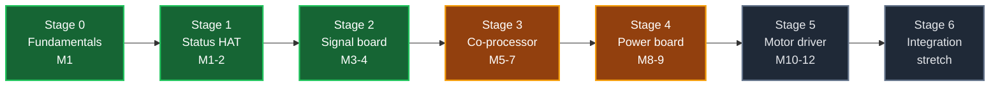

# RoverPi Custom PCB Track / 自制电路板路线图

A twelve-month, six-stage plan to design the rover's own electronics from
scratch, starting from zero PCB experience.

一份为期约十二个月、分六个阶段的计划，目标是从零基础开始，逐步把这台车的电子
部分换成自己设计的电路板。

> [!IMPORTANT]
> RoverSpine is a **parallel track** to the rover itself, not a replacement for the
> [RoverPi roadmap](https://github.com/AndyChen227/RoverPi/blob/main/docs/roadmap.md). The rover's autonomy phases and this hardware
> track advance independently and meet at Stage 3, where the encoder
> co-processor unblocks Phase 2.
>
> RoverSpine 这条线和[主路线图](https://github.com/AndyChen227/RoverPi/blob/main/docs/roadmap.md)是**并行**的，不是替代关系。两条线在第 3
> 阶段交汇——编码器协处理器是主路线图第 2 阶段的前置条件。

---

## The one rule / 唯一的铁律

**The rover must be drivable at the end of every session.**

Every stage keeps the part it replaces. A new board is installed only after it
has passed its own bring-up on the bench, and the old part goes into a labeled
bag, not into the bin. If a board fails on the floor, the fallback is a
five-minute swap, not a redesign.

This is the same principle the software side already follows: a capability is
claimed only after it has been physically verified, and nothing verified is
thrown away to make room for something unverified.

**每次收工时，车必须是能开的。**

每一个阶段都保留它所替换的那个部件。新板子只有在台面上完成单独的上电测试之后
才允许装车，被换下来的旧件装进贴好标签的袋子，不扔。板子在地面上出问题时，退
路是五分钟换回去，而不是重新设计。

这和软件那边的规矩是同一条：功能只有实测通过才能算数，已经验证过的东西不为了
给未验证的东西腾位置而丢掉。

---

## What the board can replace / 这块板能替换什么

| # | Current part | 现有部件 | Replaceable? | Stage | Note |
|---:|---|---|:---:|:---:|---|
| 1 | Raspberry Pi 5 | 树莓派 5 | ❌ No | — | Keep it. Replacing it is a different project, not an upgrade to this one |
| 2 | 7 dupont control wires | 7 根杜邦控制线 | ✅ Yes | 2 | The easiest and highest-safety-value win |
| 3 | CH9102F USB serial adapter | USB 转串口模块 | ✅ Yes | 3 | The lidar UART goes to the on-board MCU instead |
| 4 | USB power bank | 充电宝 | ✅ Yes | 4 | Needs a 5 V / 5 A buck. The riskiest replacement |
| 5 | WHEELTEC motor driver | 电机驱动板 | ✅ Yes | 5 | The graduation project. May slip past month 12 |
| 6 | Inline fuse | 保险丝 | ⚠️ Partly | 5 | Add electronic current limiting, but **keep the physical fuse** |
| 7 | Main power switch | 总开关 | ❌ Never | — | A physical cutoff must never depend on any board working |

第 1 项和第 7 项永远不换：主控换掉等于重开一个项目；物理断电开关的全部价值就在于
它不依赖任何电路正常工作。第 6 项只做增强不做替换——电子限流会失效，保险丝不会。

## What the board can add / 这块板能增加什么

These are the things you cannot buy as a module and cannot do in software.
每一项都是买不到现成模块、或者软件根本做不到的。

| Function | 功能 | Why it needs hardware | Stage |
|---|---|---|:---:|
| Heartbeat watchdog | 心跳看门狗 | If the Pi hangs, Python cannot stop anything. The last PWM value stays applied and the rover keeps driving | 3 |
| Quadrature decoding | 正交解码 | ~7000 counts/s per wheel × 4 wheels at full speed. Python will silently drop counts | 3 |
| Battery voltage monitor | 电池电压监测 | **The Pi 5 has no ADC at all.** A 3S LiPo below 9.9 V is permanent damage, and right now nothing is watching | 3 |
| Motor current sensing | 电机电流采样 | Stall detection, and a real over-current trip. Also the only honest way to know how hard the rover is working | 5 |
| Status LEDs and buzzer | 状态灯与蜂鸣器 | Directly serves the "run without SSH" goal — you need to see the state without a terminal | 1 |
| Physical E-stop input | 物理急停输入 | A button that cuts drive without going through software | 3 |
| Bumper / cliff switch inputs | 碰撞与跌落开关输入 | Covers exactly what the ≤2 mm lidar beam cannot see | 3 |
| Servo header | 舵机接口 | For the Phase 4 lidar sweep, already in the main roadmap | 3 |
| IMU footprint | IMU 焊盘 | Phase 4, decided from the Phase 3 square-test heading error | 3 |
| Keyed connectors, strain relief | 带锁扣连接器与拉力缓解 | A dupont wire falling off mid-drive is undefined behavior | 2 |

---

## Tools and budget / 工具与预算

Buy Stage 0 and Stage 1 tools now; defer the rest until the stage that needs them.
第 0、1 阶段的工具现在就买，其余的等到需要的阶段再买。

| Tool | 工具 | Approx. ¥ | Needed from |
|---|---|---:|:---:|
| Temperature-controlled iron (T12 / 936) | 恒温烙铁 | 150–300 | Stage 0 |
| Multimeter | 万用表 | 100–200 | Stage 0 |
| Solder, flux, wick, tweezers, cutters | 焊锡、助焊剂、吸锡带、镊子、斜口钳 | 80 | Stage 0 |
| **Bench supply with current limit** | **带限流的可调直流电源** | 200–400 | Stage 1 |
| USB logic analyzer (8 ch) | USB 逻辑分析仪 | 30–80 | Stage 3 |
| Hot air station | 热风枪 | 200 | Stage 3 |
| Entry digital oscilloscope | 入门数字示波器 | 800+ | Stage 4 |
| PCB fabrication, all stages | 打样，全部阶段 | 400–800 | — |
| Components, all stages | 元件，全部阶段 | 300–600 | — |

**Year total: roughly ¥2000–3000.** 全年大约两三千。

> [!TIP]
> The current-limited bench supply is the single best purchase on this list.
> Set the limit to 100 mA, power a new board for the first time, and a short
> circuit becomes a reading on a display instead of a dead board and a
> burnt trace. Never first-power a board you designed from a battery.
>
> 带限流的电源是这张表上最值得买的一件。限流设到 100 mA 给新板第一次上电，短路
> 就只是显示屏上的一个数字，而不是一块废板加一道烧断的铜箔。**自己设计的板子，
> 第一次上电永远不要用电池。**

---

## Stage 0 — Fundamentals, no PCB / 基本功，先不做板

**Month 1, weeks 1–3 / 第 1 个月前三周**

The mistake almost everyone makes is ordering a board before they can solder or
read a datasheet. Nothing is fabricated in this stage.

- [ ] Solder 30–50 practice joints on a cheap practice kit until they are consistently shiny and concave.
- [ ] Learn the multimeter: continuity, resistance, DC voltage, and **diode mode for finding shorts**.
- [ ] Install KiCad. Work through one official beginner tutorial end to end.
- [ ] **Redraw something that already exists**: capture the rover's current 7-wire Pi-to-driver connection as a KiCad schematic, using [`RoverPi/docs/wiring.md`](https://github.com/AndyChen227/RoverPi/blob/main/docs/wiring.md) as the source. No layout, no fabrication.
- [ ] Read the datasheet of one part you already own (the motor driver, or the STP-23L) and find in it: supply range, logic thresholds, absolute maximum ratings.

**Exit criterion / 完成判据:** you can produce a solder joint you are willing to
put on a moving vehicle, and you can point at any pin in your KiCad schematic
and say which physical wire it is on the rover.

这个阶段不做任何板子。绝大多数人的第一个错误是在还不会焊接、看不懂数据手册的时候
就下单打样。用 KiCad **重画一份已经存在的东西**（现有的 7 根控制线）是最好的入门
练习——因为对错可以立刻验证，你的车就是标准答案。

---

## Stage 1 — First board: status indicator HAT / 第一块板：状态指示板

**Months 1–2 / 第 1–2 个月**

The first board must be **too simple to fail** in an interesting way. Its purpose
is to teach the whole pipeline — schematic, footprint, layout, DRC, Gerber,
ordering, soldering, bring-up — not to teach circuit design.

It is still genuinely useful: the main roadmap's "run without an active SSH
session" milestone is much safer when the rover can show its state on its own.

### Specification / 规格

- Two-layer board, **through-hole only**, roughly 65 × 56 mm (standard HAT outline)
- 40-pin female header, pass-through, so the existing wiring is untouched
- 4 × LED with series resistors: `POWER` · `ARMED` · `DRIVING` · `FAULT`
- 1 × passive buzzer on a GPIO
- 1 × momentary push button, with a pull-up
- 4 × mounting holes matching the Pi 5
- Test points on every signal

### New skills / 新学的东西

Schematic symbols and footprints · net names · design rules · the 2-layer
ground pour · Gerber export and the 嘉立创 ordering flow · through-hole
soldering on a real board · **bring-up with a current limit**

### Exit criterion / 完成判据

- [ ] All four LEDs and the buzzer driven from Python on the Pi.
- [ ] The board carries a full driving session on the ground with the existing dupont wiring, and the LEDs correctly show armed / driving / stopped.
- [ ] A devlog entry recording what was wrong with the board, because something will be.

**Cost / 成本:** ≈ ¥60. **Expect a v2.** 预计要改一版。

第一块板必须**简单到出不了有意思的错**。它教的是完整流程，不是电路设计。但它并非
练习品：主路线图里"脱离 SSH 独立运行"这一项，有了板载状态灯之后才真正安全——否则
你没有终端就不知道车处于什么状态。

---

## Stage 2 — Signal board: retire the dupont wires / 信号板：干掉杜邦线

**Months 3–4 / 第 3–4 个月**

The first board that replaces something. It also brings the encoders in for the
first time, which is where the main roadmap's Phase 2 begins.

### Gating measurements — do these before drawing anything / 动手前必须先测

Per the repo's own rule, these numbers are design inputs. The schematic does not
start until they exist.

- [ ] **Encoder supply range and output level.** Many of these motors accept 3.3 V on the encoder VCC pin and output at VCC level. If yours does, the level-shifting problem disappears entirely and the board gets much simpler. **Pi 5 GPIO is not 5 V tolerant** — this measurement is a safety gate, not an optimization.
- [ ] **Encoder PPR.** Turn one wheel by hand through exactly ten revolutions and count pulses. This sets the odometry resolution and decides whether Stage 3's co-processor is actually needed.
- [ ] **Motor driver logic thresholds**, from its datasheet: what does it accept as a valid high?

### Specification / 规格

- Two-layer HAT, through-hole plus first SMD passives (0805 — deliberately large)
- 6 motor-control signals → one **keyed, latching** connector (JST-XH or similar) to the driver
- 4 × encoder input, 4-pin connector each, with pull-ups and whatever the measurement above says is needed
- Series resistors on every Pi-facing signal, as cheap protection against a wiring mistake
- Everything from Stage 1 carried forward
- Silkscreen labels on every connector, matching the names used in `docs/wiring.md`

### The measurement this stage produces / 这个阶段要产出的数据

With encoders wired directly to the Pi, **measure whether Python keeps up.**
Drive one wheel at 100% and compare the counted pulses against the true
revolutions. At full speed one wheel produces roughly 7000 counts/s, and four
wheels roughly 28000 edges/s.

If counts are dropped, that is the data that justifies Stage 3. If they are not,
Stage 3 becomes optional and you can go straight to power. **Either answer is a
result.** Do not assume the outcome in advance.

### Exit criterion / 完成判据

- [ ] All seven previously verified movement tests re-run against this board, wheels lifted, with results identical to the dupont-wire era.
- [ ] Then re-run the ground driving test.
- [ ] A/B signals visible from all four wheels.
- [ ] The Python-keeps-up measurement recorded, whichever way it comes out.

**Cost / 成本:** ≈ ¥80.

这是第一块**真正替换掉东西**的板子，也是编码器第一次接进来。注意上面那三条"动手
前必须先测"——按仓库的规矩，这些数是设计输入，量不到就不该开始画图。这个阶段还要
产出一个结论：Python 到底跟不跟得上。跟不上，第 3 阶段就有了依据；跟得上，第 3
阶段就变成可选项。**两种结果都是结果**，不要预设答案。

---

## Stage 3 — Co-processor board / 协处理器板

**Months 5–7 / 第 5–7 个月**

The biggest jump in the plan, and the one that gives the rover capabilities it
cannot otherwise have.

> [!TIP]
> **Use an RP2040 module, not a bare RP2040 chip.** A Pico or RP2040-Zero
> soldered onto your board as a module removes the QFN-56 footprint, the
> crystal, the external flash, and the USB routing from your first MCU board —
> four separate ways to fail, deleted. The bare chip belongs in Stage 6.
>
> **用 RP2040 模块，不要用裸片。** 把 Pico 或 RP2040-Zero 当成一个模块焊在你的
> 板上，等于一次性删掉 QFN-56 封装、晶振、外部 Flash、USB 走线这四个独立的失败
> 来源。裸片留到第 6 阶段。

### Specification / 规格

- RP2040 module, communicating with the Pi over I2C (or UART)
- **4 × quadrature decode in PIO.** This is what the RP2040's PIO was built for
- **Heartbeat watchdog:** the Pi must toggle a pin continuously; if it stops for more than ~200 ms, hardware pulls the driver's enable low. This works when Python is dead, which is exactly when it matters
- **Battery monitor:** resistor divider from the 3S pack into an RP2040 ADC, with a low-voltage warning well above the 9.9 V damage threshold
- Physical E-stop button input, wired into the same enable path
- 2 × bumper switch inputs, 2 × spare digital inputs
- Level-shifted UART header for the STP-23L, retiring the CH9102F adapter
- Servo header, powered separately, for the Phase 4 lidar sweep
- I2C breakout for a future IMU

### New skills / 新学的东西

SMD soldering with hot air · decoupling and why every IC gets its own capacitor ·
ADC input scaling and protection · designing an I2C register map · firmware
that must not depend on the host · **the discipline of a safety interlock that
fails closed**

### Exit criterion / 完成判据

- [ ] Hand-turn each wheel ten revolutions; the reported count matches PPR × 10 on all four.
- [ ] Drive at full speed and confirm no dropped counts, comparing against Stage 2's Python-direct numbers.
- [ ] **On the ground, mid-drive, unplug the heartbeat line. All four wheels must stop within 200 ms.** This is the same class of test as the August 16 controller-disconnect verification, and it deserves the same treatment: verified on the ground, with the rover under its own weight, or not claimed at all.
- [ ] Press the E-stop button mid-drive. Same result.
- [ ] Battery voltage reading agrees with the multimeter within 0.1 V across a discharge.
- [ ] The lidar reads correctly through the on-board UART, matching the September 4 characterization figures.

**Cost / 成本:** ≈ ¥150. **This stage will take two board revisions. Plan for it.**

这是整个计划里跨度最大的一步，也是唯一能给车带来"买不到"的能力的一步。心跳看门狗
是重点：现在所有安全机制都活在 Python 里，Pi 一旦死机，最后那个 PWM 值就一直挂着，
车会一直往前开。这块板让"Pi 死了就停车"变成硬件事实。它的验收方式必须和 8 月 16 日
验证断线保护时一样——**在地面上、车压着自己的重量、真的拔线**，否则不算。

---

## Stage 4 — Power board / 电源板

**Months 8–9 / 第 8–9 个月**

Retires the USB power bank. This is where beginners destroy hardware, so it gets
its own stage and its own rules.

> [!CAUTION]
> This stage deliberately breaks the strict power-domain separation that the
> rover has relied on since day one, and the thing on the other side of the
> regulator is a Raspberry Pi 5. Treat every step as reversible: the power bank
> stays on the rover, unplugged, until this board has run for a month.
>
> 这个阶段会**主动打破**这台车从第一天起就依赖的两个电源域隔离，而降压输出那一端
> 接的是一块树莓派 5。每一步都要可回退：充电宝留在车上、不插，直到这块板稳定运行
> 一个月为止。

### Specification / 规格

- 11.1 V (3S, 9.0–12.6 V) → 5 V, 5 A continuous
- An integrated switching regulator IC, **not** a discrete controller plus external FETs
- Reverse-polarity protection on the input
- Input fuse **in addition to** the existing inline fuse, not instead of it
- Output over-current and thermal shutdown
- A large, unbroken ground pour; the switching loop kept physically tiny
- Load test points, and a place to clip a scope probe on the output

### The rule for this stage / 这个阶段的规矩

**Never first-power this board into the Pi.** The order is:

1. Bench supply with current limit, no load — check the output voltage.
2. Resistive dummy load at 1 A, then 3 A, then 5 A for one hour.
3. Measure ripple on the scope. If it is above ~100 mV, fix the layout before going further.
4. Measure the temperature rise of the inductor and the IC.
5. Only then, and only after all four above pass, connect a Pi.

### Exit criterion / 完成判据

- [ ] One hour at 5 A with a dummy load, ripple under 100 mV, temperature rise under 40 K.
- [ ] The Pi boots and stays up through a full driving session, with no undervoltage warnings in `dmesg`.
- [ ] Motor stall on the LiPo does not brown out the Pi — this is the failure this board most plausibly introduces, so test it deliberately.

**Cost / 成本:** ≈ ¥120.

新手在这个阶段毁硬件。所以它单独成阶段，并且有一条铁规矩：**这块板第一次上电，
负载绝不能是树莓派**。按台面电源 → 假负载 1A/3A/5A → 示波器看纹波 → 测温升的顺序，
四关全过才允许接 Pi。另外要专门测一个失效：电机堵转的瞬间会不会把 Pi 拉到掉电重启——
这是这块板最有可能引入的新问题。

---

## Stage 5 — Power stage: your own motor driver / 功率级：自制电机驱动

**Months 10–12 / 第 10–12 个月**

The graduation project. It may well slip past month twelve, and that is a normal
outcome rather than a failure.

### Design decision worth making early / 一个值得早点定下来的设计选择

The current driver runs two motors in parallel per channel. Going to **one
half-bridge pair per motor** costs more board area but buys per-wheel speed
control and per-wheel current sensing — which is what Phase 3's PID and any
honest stall detection actually need. Since you are designing it anyway, design
for four channels.

现有驱动是每通道并联两个电机。改成**每个电机一路**会占更多板面积，但换来的是单轮
调速和单轮电流采样，而这正是主路线图第 3 阶段的 PID 和堵转检测真正需要的东西。既然
是自己设计，就按四路来设计。

### Specification / 规格

- 4 × integrated H-bridge driver IC with built-in gate drive, current sense, and fault reporting — an integrated part, not discrete MOSFETs, for a first power board
- Copper width and thermal relief sized from the **measured** stall current, not from the datasheet's optimism
- Per-channel current sense into the Stage 3 ADC
- Fault line into the watchdog's enable path
- The physical fuse and main switch stay in the path, untouched

### Exit criterion / 完成判据

Escalate one step at a time, and stop at the first surprise:

- [ ] One channel, no motor, scope on the output.
- [ ] One channel, one motor, wheel lifted.
- [ ] All four channels, all wheels lifted, the full movement truth table.
- [ ] Stall current measured, and the over-current trip verified by deliberately stalling a wheel.
- [ ] Ground driving, with the WHEELTEC driver in a bag on the bench, ready to go back on.

**Cost / 成本:** ≈ ¥200, and probably three revisions.

这是毕业设计。它有很大概率跨过第 12 个月，这是正常结果不是失败。验收必须一级一级
往上爬：空载单通道 → 架空单轮 → 架空四轮 → 地面。旧驱动板全程放在手边。

---

## Stage 6 — Integration / 整合 (stretch / 选做)

Merge Stages 2 through 5 into one four-layer RoverPi mainboard, with the bare
RP2040 instead of a module. Everything in it will already have been verified as
a separate board, so this stage is about layout craft and manufacturing, not
about whether the circuits work.

把第 2–5 阶段合成一块四层主板，MCU 换成裸片。里面每一个电路都已经作为独立板验证
过了，所以这一阶段考的是布局功力和可制造性，不是电路对不对。

---

## Timeline / 时间线

## How this track meets the main roadmap / 与主路线图的交汇

| PCB stage | Unblocks / affects | 影响 |
|:---:|---|---|
| 1 | Phase 1 — "run without an active SSH session" | 没有终端也能看到车的状态 |
| 2 | Phase 2 — encoder wiring, and the first PPR and level measurements | 编码器接线，以及电平和 PPR 实测 |
| 3 | Phase 2 and 3 — reliable counts, so odometry can be trusted | 计数可靠，里程计才有意义 |
| 3 | Phase 1 — a fail-safe that survives a hung Pi | Pi 死机时仍然有效的安全停车 |
| 5 | Phase 3 — per-wheel current, for PID and stall detection | 单轮电流，供 PID 和堵转检测使用 |

## Documentation rules for this track / 这条线的记录规矩

These carry over unchanged from RoverPi:

- Every board revision gets a devlog entry, including the ones that failed.
- A **bad board is worth more than a good one** if you write down why it was bad. RoverPi already keeps a [`notes/debugging/`](https://github.com/AndyChen227/RoverPi/blob/main/notes/debugging) directory for exactly this, and a retracted conclusion has already been preserved there once. This repository does the same for boards.
- Photograph every board before and after assembly.
- KiCad project files, Gerbers, and the BOM go under `hardware/<stage-name>/`.
- A board is `[x]` only after its exit criteria have been met **on the rover**. `[~]` means it exists and powers up. Same three states as the main roadmap.

以下规矩原封不动从 RoverPi 继承过来：每一版板子都写开发日志，**包括失败的那些**。一块坏板，
只要写清楚为什么坏，价值比一块好板更高——仓库里的 `notes/debugging/` 就是为这个准备
的，而且已经保存过一个被推翻的结论。板子只有在**装到车上**通过完成判据之后才能标
`[x]`；`[~]` 表示板子存在并且能上电。三态和主路线图一致。
