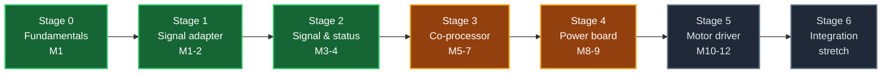

# RoverPi Custom PCB Track

A twelve-month plan to design the rover's own electronics from scratch, starting
from zero PCB experience. It runs as two parallel tracks: seven hardware stages,
and [a firmware track](#c-track) that starts in month 1 on a breadboard Pico
rather than waiting for the board that will need it.

RoverSpine is a **parallel track** to the rover itself, not a replacement for the
[RoverPi roadmap](https://github.com/AndyChen227/RoverPi/blob/main/docs/roadmap.md).
The two advance independently and meet at Stage 3, where the encoder co-processor
unblocks Phase 2.

## The one rule

**The rover must be drivable at the end of every session.**

Every stage keeps the part it replaces. A new board is installed only after it
has passed its own bring-up on the bench, and the old part goes into a labeled
bag, not into the bin. If a board fails on the floor, the fallback is a
five-minute swap, not a redesign.

<a id="mechanical"></a>

## The mechanical constraint: no HATs

The Raspberry Pi 5 sits on the rover's upper deck and already carries an active
cooler, so **nothing can be stacked on its 40-pin header.** Every RoverSpine
board is a separate board in its own small enclosure, connected by ribbon cable.

```text
Raspberry Pi 5 (upper deck, active cooler on top)
    │  2×20, 40-pin female-to-female ribbon, 10–15 cm
    ▼
RoverSpine board (upper deck, in an enclosure, double-sided tape)
    │  ribbon cables out to whatever this board serves
    ▼
Driver / encoders / sensors (lower deck and chassis corners)
```

This costs one extra cable and buys three things: the cooler keeps working, the
board can be any size the circuit wants, and a failed board is unplugged rather
than unbolted.

## What the board can replace

| # | Current part | Replaceable? | Stage | Note |
|---:|---|:---:|:---:|---|
| 1 | Raspberry Pi 5 | ❌ No | — | Replacing it is a different project |
| 2 | 10 dupont control wires | ✅ Yes | **1** | Highest safety value. Removes the 3.3 V / 5 V mis-plug hazard |
| 3 | CH9102F USB serial adapter | ✅ Yes | 3 | The lidar UART goes to the on-board MCU |
| 4 | USB power bank | ✅ Yes | 4 | Needs a 5 V / 5 A buck. The riskiest replacement |
| 5 | WHEELTEC motor driver | ✅ Yes | 5 | The graduation project. May slip past month 12 |
| 6 | Inline fuse | ⚠️ Partly | 5 | Add electronic current limiting, **keep the physical fuse** |
| 7 | Main power switch | ❌ Never | — | A physical cutoff must never depend on a board working |

## Capability menu

The stages below are the plan of record. This is the menu they were chosen from,
ranked by value per unit of difficulty.

### Tier A — high value, low difficulty

| Function | How | 难度 | Stage |
|---|---|:---:|:---:|
| Replace the 10 dupont wires | Passive adapter, keyed boxed headers | ⭐ | 1 |
| **Safe state at power-on** | 6 pull-down resistors on the driver inputs | ⭐ | 1 |
| Series protection resistors | 33 Ω on every Pi-facing signal | ⭐ | 1 |
| **Physical E-stop button** | Button in series with the driver enable path | ⭐ | 3 |
| Status LEDs, buzzer, button | GPIO + current-limiting resistors | ⭐ | 2 |
| Encoder interface | Connectors + pull-ups (**measure the level first**) | ⭐⭐ | 2 |
| Regulated sensor supply | Off-the-shelf LDO or buck module | ⭐ | 2 |
| Test points, silkscreen, spare pads | Free at draw time; impossible after fabrication | ⭐ | all |

### Tier B — high value, medium difficulty

| Function | How | Firmware? | 难度 | Stage |
|---|---|:---:|:---:|:---:|
| **Battery voltage monitor** | Divider + ADS1115 (I2C 16-bit ADC), read from Python | ❌ | ⭐⭐ | 3 |
| **Current monitor** | INA226 / INA219 + shunt | ❌ | ⭐⭐ | 3 / 5 |
| **Heartbeat watchdog** | Pure hardware: retriggerable monostable (CD4538) or a watchdog IC (TPS3813 / MAX6369) | ❌ | ⭐⭐⭐ | 3 |
| IMU (heading) | MPU6050 / ICM-42688 on I2C | ❌ | ⭐⭐ | 3+ |
| Bumper switches | Microswitch + pull-up + series resistor | ❌ | ⭐ | 3 |
| Cliff / drop detection | Reflective IR sensor | ❌ | ⭐⭐ | 3+ |
| Ultrasonic range | HC-SR04 class — covers the lidar's blind spot | ❌ | ⭐⭐ | 3+ |
| Lidar UART onto the board | On-board USB-UART, retires the CH9102F | ❌ | ⭐⭐⭐ | 3 |
| **4-channel quadrature decode** | RP2040 PIO | ✅ **required** | ⭐⭐⭐⭐ | 3 |

### Tier C — hard, and the real craft

| Function | The hard part | 难度 | Stage |
|---|---|:---:|:---:|
| Power board 11.1 V → 5 V / 5 A | Switching layout. **Never first-power it into the Pi** | ⭐⭐⭐⭐ | 4 |
| 4-channel H-bridge driver | Power, thermals, copper width, dead time | ⭐⭐⭐⭐⭐ | 5 |
| Over-current / stall cutoff | Current sense into a fast comparator cutoff | ⭐⭐⭐⭐ | 5 |
| Four-layer mainboard | Layout craft; bare RP2040 instead of a module | ⭐⭐⭐⭐⭐ | 6 |

**The microcontroller has exactly one irreplaceable job in this project:
four-channel high-speed quadrature decode** — roughly 28 000 edges/s across four
wheels at full speed, which Python drops silently. Everything else in Tier B has
a no-firmware path. Tier A and most of Tier B are reachable without writing a
line of firmware.

<a id="c-track"></a>

## The parallel firmware track

**The language is not decided.** It is an end-of-month-1 decision made from a
measurement, not from reading.

<a id="lang-eval"></a>

### The month-1 evaluation

Buy two Raspberry Pi Picos (≈¥25 each) and write **the same blink program** in
each candidate. The Pico carries the same chip as the Stage 3 board but needs no
PCB, so this costs ¥50 and no schedule.

| Candidate | What it gives | What it costs |
|---|---|---|
| **C** on the Pico SDK | The language every chip datasheet's reference code is written in | CMake, and the steepest toolchain of the three |
| **C++** on arduino-pico | No CMake, `setup()`/`loop()`, one-click upload. Exposes PIO, so Stage 3 stays reachable | You still need to *read* C — the vendor examples are C |
| **MicroPython** | A REPL. Change a line, see it immediately | Every vendor example translated by hand; high-speed work goes through PIO |

**The criterion:** after finishing blink, which one makes you want to write a
second program?

**Buy two Picos, not one.** The second, flashed with `debugprobe` firmware, is an
SWD debugger for the first. Embedded crashes are usually silent hangs.

The firmware track runs from month 1 on a breadboard, so quadrature decode, the
watchdog timing and the UART protocol are proven before the Stage 3 board exists.

## Tools and budget

Buy Stage 0 and Stage 1 tools now; defer the rest to the stage that needs them.
The full inventory — owned, ordered, still to buy, with a running total — is in
[`tools-and-parts.md`](tools-and-parts.md). How a project becomes a physical
board is in [`fabrication.md`](fabrication.md).

**Year total: roughly ¥2000–3000.**

The current-limited bench supply is the single best purchase on the list. Set the
limit to 100 mA, power a new board for the first time, and a short becomes a
reading on a display instead of a dead board. **Never first-power a board you
designed from a battery.** Stage 1 is passive and draws nothing, so the supply is
needed from Stage 2.

## Stage 0 — Fundamentals, no PCB

**Month 1, weeks 1–3.** Nothing is fabricated in this stage.

**Hardware**

- [ ] **Learn to judge a solder joint**: shiny, concave, wetting both pad and
      lead — and what a cold joint, a bridge and a starved joint look like.
      Assembly is done in the home workshop, so producing joints is not on this
      track; accepting them is.
- [ ] Learn the multimeter: continuity, resistance, DC voltage, and **diode mode
      for finding shorts.** This is the one tool on this track that cannot be
      borrowed — it is needed at the rover.
- [x] Install KiCad. *(10.0.6, 2026-09-08.)* Work through one beginner tutorial.
- [ ] **Redraw something that already exists**: capture the rover's 10-wire
      Pi-to-driver connection as a KiCad schematic, from
      [`RoverPi/docs/wiring.md`](https://github.com/AndyChen227/RoverPi/blob/main/docs/wiring.md).
      Draw it from the **physical pin numbers**, not the BCM numbers.
- [ ] Read the datasheet of one part you own and find: supply range, logic
      thresholds, absolute maximum ratings.

**Firmware**

- [ ] Buy two Picos and a breadboard.
- [ ] Install the toolchain for **each** candidate and build `blink` in each.
- [ ] Modify `blink` until the LED pattern is one you chose. The milestone is a
      working edit-build-flash loop, not clever code.
- [ ] Flash the second Pico with `debugprobe` and step through a line on the first.
- [ ] **Decide the language** and record the decision in a devlog entry.

**Exit criterion:** you can look at a solder joint and say whether you are
willing to put it on a moving vehicle; you can point at any pin in your KiCad
schematic and say which physical wire it is on the rover; you can change one line
of code, build it, flash it, and see the change; and the language question is
closed, with a written reason.

<a id="stage-1"></a>

## Stage 1 — First board: passive signal adapter

**Months 1–2.**

The first board must be **too simple to fail** in an interesting way. Its purpose
is to teach the whole pipeline — schematic, footprint, layout, DRC, Gerber,
ordering, assembly, bring-up, installation — not circuit design.

- **Passive. Nothing on it can burn.**
- It teaches the entire pipeline end to end.
- It replaces a real failure mode: vibration works a dupont jumper loose, and a
  detached direction pin is undefined motor behaviour.
- The fallback is five minutes — unplug the ribbon, put the dupont wires back.

### Specification — Rev A

- Two-layer board, small, in its own enclosure — **not a HAT**.
- **Through-hole as built.** The 6 series resistors are through-hole axial parts
  and **must be populated** — they sit in the signal path, so an empty series pad
  is an open signal. The 6 pull-downs are the only optional parts: 0805 pads that
  Rev A may ship empty.
- 1 × 2×20 connector to the Pi, via a 10–15 cm female-to-female ribbon.
- 1 × **2×5 boxed header (`DC3-10P`)** to the D50A, via a ≈35 cm ribbon. Boxed,
  not plain — the D50A's own control header is shrouded, so a matching boxed
  header makes both ends keyed.
- **10 connections to the D50A, forming 14 nets:** 6 motor-control signals, `GND`
  (two pins), `+3V3` (two pins). Each signal passes through a series resistor,
  splitting it into a Pi-side net and a driver-side net. `GND` and `+3V3` stay
  direct copper. See [the net structure](#nets).
- Readable silkscreen on every signal. **Use the D50A's own short-form names at
  J2** — `V` `P1` `A1` `B1` `G`. Pi-side names stay `PWM1` / `INA1` / ….
- No microcontroller, no firmware, no battery input, no regulator, no motor power.
- Test points on every signal.
- **Both GND positions connected.** The D50A header has two. Connecting one means
  the return current for all six signals goes through a single IDC contact.

> **`V` is a 3.3 V input, and 5 V will damage it.** On the Pi header, 3.3 V is
> physical pins 1 and 17; 5 V is pins 2 and 4, one row over and immediately
> adjacent. The `+3V3` net must originate **only** at pins 1 and 17. A dupont wire
> can be moved onto pin 2 in a second; a copper trace cannot be mis-plugged at
> all, so the failure mode disappears permanently.

### Gating checks — before footprints are frozen

- [ ] The cables have arrived, and both are confirmed female-to-female.
- [ ] Pitch confirmed 2.54 mm, and the socket confirmed to mate with a boxed header.
- [ ] **Which physical D50A pin is pin 1 — resolved, not assumed.** Both ends are
      keyed, so only one orientation is possible: plug the ribbon on and find by
      continuity which conductor reaches each signal. `G` is continuous with the
      motor-power negative `P-`, which cross-checks the map. **This is the one
      unknown that can silently swap `PWM1` onto the driver's `P2` input.**
- [ ] Pin 1 / red-stripe direction identified at both ends of both cables.
- [ ] Continuity checked pin by pin, **before either cable touches the rover**.
- [ ] Connector body size and clearance checked against the enclosure — a boxed
      header is taller than plain pins.
- [ ] **Axial resistor body length and lead diameter measured** before the
      footprint is frozen.

### Confirmed signal map

| D50A silkscreen | Signal | Pi physical pin | BCM / rail | Channel |
|:---:|---|---:|---|---|
| `P1` | `PWM1` | 32 | GPIO12 | 1 — left |
| `A1` | `INA1` | 16 | GPIO23 | 1 |
| `B1` | `INB1` | 18 | GPIO24 | 1 |
| `P2` | `PWM2` | 33 | GPIO13 | 2 — right |
| `A2` | `INA2` | 29 | GPIO5 | 2 |
| `B2` | `INB2` | 31 | GPIO6 | 2 |
| `G` (×2) | `GND` | 34, 39 | GND | both |
| `V` (×2) | `+3V3` | **1, 17** | **3.3 V — never 5 V** | both |

<a id="nets"></a>

### The net structure

Fourteen nets. Each signal is split by its series resistor into a Pi-side net and
a driver-side net; the pull-down sits on the driver side.

```
PWM1 ──[ R1 · 33 Ω ]──┬── P1
                      │
                  [ R7 · 10 kΩ ]
                      │
                     GND
```

| Pi-side net | Series | Driver-side net | Pull-down | D50A pin |
|---|:---:|---|:---:|:---:|
| `PWM1` | `R1` | `P1` | `R7` | 7 |
| `INA1` | `R2` | `A1` | `R8` | 5 |
| `INB1` | `R3` | `B1` | `R9` | 3 |
| `PWM2` | `R4` | `P2` | `R10` | 8 |
| `INA2` | `R5` | `A2` | `R11` | 6 |
| `INB2` | `R6` | `B2` | `R12` | 4 |
| `+3V3` | — | direct copper | — | 9, 10 |
| `GND` | — | direct copper | — | 1, 2 |

**`R1`–`R6` are the series resistors; `R7`–`R12` are the pull-downs.**

Three decisions in this structure:

1. **Driver-side nets are named `P1` / `A1` / `B1`, not `PWM1_D`.** The label on
   the net becomes the label on the silkscreen at the end that plugs into the
   D50A, and that end reads `P1`.
2. **The pull-down sits on the driver side, after the series resistor.** If a
   series resistor is missing or its joint cracks, a driver-side pull-down still
   holds the driver input low. A Pi-side pull-down leaves it floating.
3. **Pull-downs make the power-on state safe.** Between Pi power-on and the
   Python starting, GPIO is high-impedance; the pull-downs make that window mean
   *stopped* rather than undefined. If Rev A ships without them, mark those six
   **DNP** in KiCad rather than noting it in the BOM.

### The direction truth table

From WHEELTEC's own STM32 example (`moto.c` v5.7):

| Action | `A` | `B` | PWM duty |
|---|:---:|:---:|---|
| Forward | high | low | 3000/7200 ≈ 42% |
| Reverse | low | high | 4000/7200 ≈ 56% |

PWM runs at 10 kHz. **The vendor never drives both direction pins to the same
level**, which is exactly what the pull-downs do. Both-low is expected to mean
"stopped" for this class of H-bridge, but it is neither documented nor
demonstrated — it is an assumption until measured.

### New skills

Schematic symbols and footprints · net names · ERC · design rules · the 2-layer
ground pour · Gerber export and the 嘉立创 ordering flow · writing an assembly
spec someone else builds from · inspecting a board you did not solder ·
ribbon-cable pin-1 discipline

### Exit criterion

- [ ] ERC reports **30 errors / 0 warnings**, every one accounted for, **run by
      command and not read off a panel.**
- [ ] **All 14 nets compared against [the net structure](#nets)** one by one, by
      [the checker](../hardware/stage1-signal-adapter/tools/README.md).
- [ ] **All 14 footprints compared against the same map.** ERC cannot do this:
      `R1`–`R12` all declare the filter `R_*`, which the 0805 and the axial
      footprint match equally, so swapping them passes ERC at a clean 30 / 0.
- [ ] Continuity verified on the fabricated board, pin to pin, before it touches
      the Pi.
- [ ] **Pi-side to driver-side reads ≈33 Ω, not 0 Ω.** Read the value; do not just
      listen for the buzzer. 0 Ω means a bridged resistor; an open means a missing
      one.
- [ ] **Each pull-down measured to `GND`:** ≈10 kΩ if populated, open if
      deliberately empty. A value that is neither is a fault.
- [ ] **`+3V3` verified to reach `V` from Pi pins 1 and 17 only**, and verified
      *not* continuous with pins 2 or 4.
- [ ] **Current drawn by the D50A's isolated side, measured and recorded.**
- [ ] **Wheels lifted: hold both direction pins low, apply PWM, confirm the motor
      does not turn.** If both-low is not "stopped", the pull-down plan is
      redesigned before Rev B.
- [ ] All seven previously verified movement tests re-run through this board,
      wheels lifted, results identical to the dupont-wire era.
- [ ] Then the ground driving test, re-run.
- [ ] The dupont wires bagged and labeled, not discarded.

## Stage 2 — Signal & status board

**Months 3–4.** A functional superset of Stage 1. When it goes on the rover, the
Stage 1 adapter comes off into a labeled bag as the five-minute fallback.

### Gating measurements — before drawing anything

These are design inputs and need no new hardware, so they can be done while
Stage 1 is at the fab: the encoder output level, the encoder PPR, and whether the
encoders need pull-ups.

### Specification

- Two-layer board in an enclosure, through-hole plus 0805 passives. **Not a HAT.**
- **Everything from Stage 1 carried forward**, with the 6 pull-downs **populated**
  rather than reserved, so the power-on safe state stops being optional.
- 4 × encoder input, 4-pin connector each, with pull-ups as the measurement says.
- 4 × status LED with series resistors: `POWER` · `ARMED` · `DRIVING` · `FAULT`.
- 1 × passive buzzer on a GPIO.
- 1 × momentary push button, with a pull-up.
- Regulated sensor supply rail, from an off-the-shelf module.
- Spare GPIO, UART and I2C brought out to pads.

### The measurement this stage produces

With encoders wired directly to the Pi, **measure whether Python keeps up.** Drive
one wheel at 100% and compare counted pulses against true revolutions — roughly
7000 counts/s per wheel, 28 000 edges/s across four.

If counts are dropped, that is the data that justifies Stage 3. If not, Stage 3's
quadrature decoding becomes optional. **Either answer is a result.**

### Exit criterion

- [ ] All four LEDs and the buzzer driven from Python on the Pi.
- [ ] All seven movement tests re-run, wheels lifted, results identical.
- [ ] Ground driving test re-run, LEDs correctly showing armed / driving / stopped.
- [ ] A/B signals visible from all four wheels.
- [ ] The Python-keeps-up measurement recorded, whichever way it came out.
- [ ] The Stage 1 adapter bagged and labeled as the fallback.
- [ ] A devlog entry.

**Cost:** ≈ ¥100. Expect a v2. This is the first board that draws current, so the
bench supply is needed from here.

## Stage 3 — Co-processor board

**Months 5–7.** The biggest jump in the plan. By the time it starts, the firmware
should already exist on a breadboard Pico.

### Specification

- RP2040 module, talking to the Pi over **UART** — simpler to get right on both
  ends than I2C, and costs nothing in capability here.
- **4 × quadrature decode in PIO.** The one job on this board with no
  no-firmware alternative.
- **Heartbeat watchdog:** the Pi toggles a pin continuously; if it stops for more
  than ~200 ms, hardware pulls the driver's enable low. **A hardware-only
  implementation is preferred** — it has no firmware that can itself hang.
- **Battery monitor:** divider from the 3S pack into an ADC, with a low-voltage
  warning well above the 9.9 V damage threshold.
- Physical E-stop button input, into the same enable path.
- 2 × bumper switch inputs, 2 × spare digital inputs.
- Level-shifted UART header for the STP-23L, retiring the CH9102F.
- Servo header, powered separately, for the Phase 4 lidar sweep.
- I2C breakout for a future IMU.

### New skills

SMD soldering with hot air · decoupling · ADC input scaling and protection ·
designing a UART message format · firmware that must not depend on the host
being alive · **a safety interlock that fails closed**

### Exit criterion

- [ ] Hand-turn each wheel ten revolutions; the reported count matches PPR × 10
      on all four.
- [ ] Drive at full speed with no dropped counts, against Stage 2's numbers.
- [ ] **On the ground, mid-drive, unplug the heartbeat line. All four wheels stop
      within 200 ms.** Verified on the ground, under the rover's own weight, or
      not claimed at all.
- [ ] Press the E-stop mid-drive. Same result.
- [ ] Battery reading agrees with the multimeter within 0.1 V across a discharge.
- [ ] The lidar reads correctly through the on-board UART.
- [ ] The CH9102F bagged and labeled.

**Cost:** ≈ ¥150. **Plan for two board revisions.**

## Stage 4 — Power board

**Months 8–9.** Retires the USB power bank.

This stage deliberately breaks the power-domain separation the rover has relied
on since day one, and the thing on the other side of the regulator is a Pi 5.
**The power bank stays on the rover, unplugged, until this board has run for a
month.**

### Specification

- 11.1 V (3S, 9.0–12.6 V) → 5 V, 5 A continuous.
- An integrated switching regulator IC, **not** a discrete controller plus FETs.
- Reverse-polarity protection on the input.
- Input fuse **in addition to** the existing inline fuse, not instead of it.
- Output over-current and thermal shutdown.
- A large unbroken ground pour; the switching loop kept physically tiny.
- Load test points, and a place to clip a scope probe on the output.

### The rule for this stage

**Never first-power this board into the Pi.** The order is:

1. Bench supply with current limit, no load — check the output voltage.
2. Resistive dummy load at 1 A, then 3 A, then 5 A for one hour.
3. Measure ripple. Above ~100 mV, fix the layout before going further.
4. Measure the temperature rise of the inductor and the IC.
5. Only after all four pass, connect a Pi.

### Exit criterion

- [ ] One hour at 5 A with a dummy load, ripple under 100 mV, temperature rise
      under 40 K.
- [ ] The Pi boots and stays up through a full driving session, no undervoltage
      warnings in `dmesg`.
- [ ] Motor stall on the LiPo does not brown out the Pi — test it deliberately.
- [ ] The power bank kept on the rover, unplugged, for a month.

**Cost:** ≈ ¥120.

## Stage 5 — Power stage: your own motor driver

**Months 10–12.** The graduation project. It may slip past month twelve, which is
a normal outcome rather than a failure.

The current driver runs two motors in parallel per channel. **Design for four
channels** — one half-bridge pair per motor. It costs board area and buys
per-wheel speed control and per-wheel current sensing, which is what Phase 3's
PID and any honest stall detection need.

### Specification

- 4 × integrated H-bridge driver IC with built-in gate drive, current sense and
  fault reporting — integrated parts, not discrete MOSFETs, for a first power
  board.
- Copper width and thermal relief sized from the **measured** stall current.
- Per-channel current sense into the Stage 3 ADC.
- Fault line into the watchdog's enable path.
- The physical fuse and main switch stay in the path, untouched.

### Exit criterion

Escalate one step at a time, and stop at the first surprise:

- [ ] One channel, no motor, scope on the output.
- [ ] One channel, one motor, wheel lifted.
- [ ] All four channels, all wheels lifted, the full movement truth table.
- [ ] Stall current measured, and the over-current trip verified by deliberately
      stalling a wheel.
- [ ] Ground driving, with the WHEELTEC driver in a bag on the bench.

**Cost:** ≈ ¥200, and probably three revisions.

## Stage 6 — Integration (stretch)

Merge Stages 2 through 5 into one four-layer RoverPi mainboard, with the bare
RP2040 instead of a module. Every circuit in it will already have been verified
as a separate board, so this stage is about layout craft and manufacturability.

"Mainboard" still does not mean a HAT — it means one board instead of four,
still ribbon-connected to the Pi.

## Timeline



## How this track meets the main roadmap

| PCB stage | Unblocks / affects |
|:---:|---|
| 1 | Nothing is unblocked — this one buys **mechanical reliability** |
| 2 | Phase 1 — run without an active SSH session |
| 2 | Phase 2 — encoder wiring, and the first PPR and level measurements |
| 3 | Phase 2 and 3 — reliable counts, so odometry can be trusted |
| 3 | Phase 1 — a fail-safe that survives a hung Pi |
| 5 | Phase 3 — per-wheel current, for PID and stall detection |

## Documentation rules for this track

- Every board revision gets a devlog entry, including the ones that failed.
- A **bad board is worth more than a good one** if you write down why it was bad.
- Photograph every board before and after assembly.
- KiCad projects, Gerbers and the BOM go under `hardware/<stage>-<board-name>/`.
- A board is `[x]` only after its exit criteria have been met **on the rover**.
  `[~]` means it exists and powers up. `[ ]` is pending. **Never `[x]` because the
  schematic looks right.**

---

# 自制电路板路线图 / 中文

一份为期约十二个月的计划，目标是从零基础开始，逐步把这台车的电子部分换成自己设计的电路板。
它由两条并行的线组成：**七个硬件阶段**，以及一条[固件线](#c-track)——后者从第 1 个月起就在
面包板上的 Pico 上跑，而不是等到需要它的那块板子出现。

RoverSpine 这条线和[主路线图](https://github.com/AndyChen227/RoverPi/blob/main/docs/roadmap.md)是**并行**的，
不是替代关系。两条线在第 3 阶段交汇——编码器协处理器是主路线图第 2 阶段的前置条件。

## 唯一的铁律

**每次收工时，车必须是能开的。**

每一个阶段都保留它所替换的那个部件。新板子只有在台面上完成单独的上电测试之后才允许装车，
被换下来的旧件装进贴好标签的袋子，不扔。板子在地面上出问题时，退路是五分钟换回去，
而不是重新设计。

## 机械约束：不做 HAT

树莓派 5 在第二层，上方已经装了主动散热器，所以**它的 40 针排针上不能再叠任何东西**。
RoverSpine 的每一块板都是装在自己小外壳里的独立板，用排线连接。

```text
Raspberry Pi 5（第二层，上面是主动散热器）
    │  2×20 四十针排线，母对母，10–15 cm
    ▼
RoverSpine 板（第二层，装在外壳里，双面胶固定）
    │  排线接到这块板要服务的东西
    ▼
驱动板 / 编码器 / 传感器（第一层和底盘四角）
```

代价是多一条排线，换来三件事：散热器继续工作、板子的尺寸可以完全按电路需要来定、
坏板子是拔下来而不是拆下来。

## 这块板能替换什么

| # | 现有部件 | 能换吗 | 阶段 | 说明 |
|---:|---|:---:|:---:|---|
| 1 | 树莓派 5 | ❌ 不换 | — | 换掉它等于重开一个项目 |
| 2 | 10 根杜邦控制线 | ✅ 能 | **1** | 安全价值最高，并消除 3.3 V / 5 V 插错的风险 |
| 3 | CH9102F USB 转串口 | ✅ 能 | 3 | 激光雷达 UART 改接板上的 MCU |
| 4 | 充电宝 | ✅ 能 | 4 | 需要 5 V / 5 A 降压，风险最大的一次替换 |
| 5 | WHEELTEC 电机驱动板 | ✅ 能 | 5 | 毕业设计，可能跨过第 12 个月 |
| 6 | 保险丝 | ⚠️ 部分 | 5 | 增加电子限流，**保留物理保险丝** |
| 7 | 总开关 | ❌ 永不 | — | 物理断电不能依赖任何板子正常工作 |

## 可选功能清单

下面的阶段划分是当前执行计划；这一节是它们从里面挑出来的菜单，按"每一分难度换来多少价值"
排序。

### A 档：高价值、低难度

| 功能 | 怎么做 | 难度 | 阶段 |
|---|---|:---:|:---:|
| 替换 10 根杜邦线 | 被动转接板，防呆牛角座 | ⭐ | 1 |
| **上电默认安全状态** | 驱动输入加 6 个下拉电阻 | ⭐ | 1 |
| 信号串联保护电阻 | 每路 Pi 侧信号串 33 Ω | ⭐ | 1 |
| **物理急停按钮** | 按钮串进驱动使能回路 | ⭐ | 3 |
| 状态灯、蜂鸣器、按钮 | GPIO + 限流电阻 | ⭐ | 2 |
| 编码器接口 | 连接器 + 上拉（**先测电平**） | ⭐⭐ | 2 |
| 传感器统一稳压供电 | 现成的 LDO 或降压模块 | ⭐ | 2 |
| 测试点、丝印、备用焊盘 | 画图时免费，打样后加不了 | ⭐ | 全部 |

### B 档：高价值、中难度

| 功能 | 怎么做 | 要固件 | 难度 | 阶段 |
|---|---|:---:|:---:|:---:|
| **电池电压监测** | 分压 + ADS1115（I2C 16 位 ADC），Python 读 | ❌ | ⭐⭐ | 3 |
| **电流监测** | INA226 / INA219 + 采样电阻 | ❌ | ⭐⭐ | 3 / 5 |
| **心跳看门狗** | 纯硬件：可重触发单稳（CD4538）或看门狗芯片 | ❌ | ⭐⭐⭐ | 3 |
| IMU（航向角） | MPU6050 / ICM-42688，走 I2C | ❌ | ⭐⭐ | 3+ |
| 碰撞开关 | 微动开关 + 上拉 + 串阻 | ❌ | ⭐ | 3 |
| 跌落检测 | 反射式红外传感器 | ❌ | ⭐⭐ | 3+ |
| 超声波测距 | HC-SR04 一类，补激光的盲区 | ❌ | ⭐⭐ | 3+ |
| 激光 UART 直接进板 | 板载 USB-UART，淘汰 CH9102F | ❌ | ⭐⭐⭐ | 3 |
| **四路硬件正交解码** | RP2040 PIO | ✅ **必须** | ⭐⭐⭐⭐ | 3 |

### C 档：难，也是真本事

| 功能 | 难在哪 | 难度 | 阶段 |
|---|---|:---:|:---:|
| 电源板 11.1 V → 5 V / 5 A | 开关电源布局。**第一次上电绝不能接树莓派** | ⭐⭐⭐⭐ | 4 |
| 自制四路 H 桥 | 功率、散热、铜箔宽度、死区时间 | ⭐⭐⭐⭐⭐ | 5 |
| 过流 / 堵转切断 | 电流采样进快速比较器切断 | ⭐⭐⭐⭐ | 5 |
| 四层主板整合 | 布局功力；用裸 RP2040 而不是模块 | ⭐⭐⭐⭐⭐ | 6 |

**单片机在这个项目里只有一个真正不可替代的用途——四路高速正交解码**（满速四轮约
28000 边沿/秒，Python 会悄无声息地丢计数）。B 档其余功能都有"不写固件"的路。
**A 档和 B 档的大半，可以在一行固件都不写的情况下拿到手。**

## 并行的固件线

**语言尚未决定。** 它是第 1 个月末根据**实测**做的决定，不是读出来的结论。

### 第 1 个月的评估

买两块树莓派 Pico（每块约 ¥25），用每个候选**写同一个 blink**。Pico 上的芯片和第 3 阶段
板上要用的是同一颗，但它完全不需要 PCB——所以这件事花 ¥50，不占进度。

| 候选 | 给你什么 | 代价 |
|---|---|---|
| **C**，原生 Pico SDK | 芯片手册的参考代码都是用它写的 | CMake，三者里工具链最陡 |
| **C++**，arduino-pico | 不用 CMake，`setup()`/`loop()`，一键烧录。开放 PIO，第 3 阶段仍然够得着 | 你仍然得**能读** C——厂家例程都是 C |
| **MicroPython** | 有 REPL，改一行立刻看到结果 | 每个厂家例程都要手工翻译；高速部分仍要走 PIO |

**判据：写完 blink 之后，哪一个让你想写第二个程序。**

**买两块 Pico，不是一块。** 第二块刷上 `debugprobe` 固件，就是第一块的 SWD 调试器。
嵌入式代码崩溃往往表现为静默死机。

固件线从第 1 个月就在面包板上跑，所以正交解码、看门狗时序和 UART 协议在第 3 阶段的板子
出现之前就已经验证过了。

## 工具与预算

第 0、1 阶段的工具现在就买，其余的等到需要的阶段再买。完整总账（已有、在途、待买，
含累计）在 [`tools-and-parts.md`](tools-and-parts.md)。工程怎么变成实体板在
[`fabrication.md`](fabrication.md)。

**全年大约 ¥2000–3000。**

带限流的台面电源是这张表上最值得买的一件。限流设到 100 mA 给新板第一次上电，短路就只是
显示屏上的一个数字，而不是一块废板。**自己设计的板子，第一次上电永远不要用电池。**
第 1 阶段是纯被动、自己不取电，所以这件从第 2 阶段起需要。

## 第 0 阶段——基本功，不做板

**第 1 个月前三周。** 这个阶段不做任何板子。

**硬件线**

- [ ] **学会判断一个焊点**：又亮又凹、焊盘和引脚都吃上锡——以及冷焊、连锡、缺锡长什么样。
      焊接在家里的工具间完成，所以"做出焊点"不在这条线上，"验收焊点"在。
- [ ] 学会用万用表：通断、电阻、直流电压，以及**用二极管档找短路**。
      这是这条线上唯一借不到的工具——它要用在车那边。
- [x] 装 KiCad。*（10.0.6，2026-09-08。）* 完整走一遍官方入门教程。
- [ ] **重画一份已经存在的东西**：把车上现有的 10 根 Pi-到-驱动的连接画成 KiCad 原理图，
      来源是 [`RoverPi/docs/wiring.md`](https://github.com/AndyChen227/RoverPi/blob/main/docs/wiring.md)。
      **按物理引脚号画，不是 BCM 号。**
- [ ] 读一份你已经拥有的元件的数据手册，找到：供电范围、逻辑电平阈值、绝对最大额定值。

**固件线**

- [ ] 买两块 Pico 和一块面包板。
- [ ] 给**每一个**候选装好工具链，各自把 `blink` 编译烧录成功。
- [ ] 改 `blink` 直到 LED 闪成你自己定的样子。**里程碑是打通"改—编译—烧录"这个循环**，
      不是写出聪明的代码。
- [ ] 第二块 Pico 刷 `debugprobe`，在第一块上单步走一行代码。
- [ ] **把语言定下来**，并把决定写进开发日志。

**完成判据：** 你能看着一个焊点说出你愿不愿意把它装到运动的车上；你能指着 KiCad 原理图上
任何一个引脚，说出它对应车上哪一根线；你能改一行代码、编译、烧录、看到变化；
而且语言问题已经关掉，理由写下来了。

## 第 1 阶段——第一块板：被动信号转接板

**第 1–2 个月。**

第一块板必须**简单到出不了有意思的错**。它教的是完整流程——原理图、封装、布局、DRC、
Gerber、下单、装配、上电、装车——不是电路设计。

- **被动。板上没有一个元件会烧。**
- 它教的仍然是完整的一条流水线。
- 它替换的是真实失效：振动使杜邦线松脱，方向线一旦脱落，电机行为未定义。
- 退路只要五分钟——拔掉排线，把杜邦线插回去。

### 规格 —— Rev A

- 双层板，小，装在自己的外壳里——**不是 HAT**。
- **按通孔件做。** 6 个串阻是通孔轴向件，**必须焊上**——它们在信号路径上，焊盘空着就是断路。
  6 个下拉是唯一真正可选的件：0805 焊盘，Rev A 可以空着出厂。
- 1 个 2×20 连接器接 Pi，配 10–15 cm 母对母排线。
- 1 个 **2×5 牛角座（`DC3-10P`）** 接 D50A，配约 35 cm 排线。**要牛角座不要光针**——
  D50A 自己的控制口带外壳，配同规格牛角座之后两端都防呆。
- **到 D50A 共 10 个连接，构成 14 个网络**：6 路电机控制信号、`GND`（两针）、`+3V3`（两针）。
  每路信号经过一个串阻，被拆成 Pi 侧网络和驱动侧网络。`GND` 和 `+3V3` 仍是铜箔直连。
  见[网络结构](#nets)。
- 每路信号都有清楚的丝印。**J2 那端用 D50A 自己的简写** —— `V` `P1` `A1` `B1` `G`。
  Pi 侧名字保持 `PWM1` / `INA1` / …。
- 不用单片机、不需要固件、不接电池、没有稳压器、不碰电机功率。
- 每路信号都有测试点。
- **两个 GND 位置都接。** D50A 的排针有两个 GND；只接一个，六路信号的回流就全靠一个 IDC
  触点。

> **`V` 是 3.3 V 输入，5 V 会烧掉它。** 树莓派排针上 3.3 V 是 1 号和 17 号针，
> 而 5 V 是 2 号和 4 号针，就在隔壁一排紧挨着。板上的 `+3V3` 网络**只能**来自 1 号和 17 号针。
> 杜邦线一秒钟就能插错到 2 号针上，而铜箔根本无法插错，这个失效模式永久消失。

### 锁封装前必须先做

- [ ] 排线已到货，确认两条都是母对母。
- [ ] 确认间距 2.54 mm，确认母座能配牛角座。
- [ ] **确定 D50A 物理上哪个针是第 1 脚——要实测，不是假设。** 两端都防呆，只有一种插法：
      把排线插上去，逐根量导通，看哪根线通到哪个信号。`G` 与电机电源负极 `P-` 导通，
      可以交叉验证。**这是唯一一个会悄悄把 `PWM1` 接到驱动板 `P2` 输入上的未知量。**
- [ ] 两条线两端的 1 号针 / 红边方向都认出来。
- [ ] **在任何一条排线接触小车之前**，先逐针检查导通。
- [ ] 对照外壳确认连接器本体尺寸和间隙——牛角座比光针高。
- [ ] **锁封装前先量轴向电阻的体长和引脚直径。**

### 已确认信号表

| D50A 丝印 | 信号 | Pi 物理针脚 | BCM / 电源 | 通道 |
|:---:|---|---:|---|---|
| `P1` | `PWM1` | 32 | GPIO12 | 1——左 |
| `A1` | `INA1` | 16 | GPIO23 | 1 |
| `B1` | `INB1` | 18 | GPIO24 | 1 |
| `P2` | `PWM2` | 33 | GPIO13 | 2——右 |
| `A2` | `INA2` | 29 | GPIO5 | 2 |
| `B2` | `INB2` | 31 | GPIO6 | 2 |
| `G`（×2） | `GND` | 34, 39 | GND | 两个 |
| `V`（×2） | `+3V3` | **1, 17** | **3.3 V——绝不能是 5 V** | 两个 |

### 网络结构

14 个网络。每路信号被它的串阻拆成 Pi 侧和驱动侧两条网络，下拉接在驱动侧。

```
PWM1 ──[ R1 · 33 Ω ]──┬── P1
                      │
                  [ R7 · 10 kΩ ]
                      │
                     GND
```

| Pi 侧网络 | 串阻 | 驱动侧网络 | 下拉 | D50A 引脚 |
|---|:---:|---|:---:|:---:|
| `PWM1` | `R1` | `P1` | `R7` | 7 |
| `INA1` | `R2` | `A1` | `R8` | 5 |
| `INB1` | `R3` | `B1` | `R9` | 3 |
| `PWM2` | `R4` | `P2` | `R10` | 8 |
| `INA2` | `R5` | `A2` | `R11` | 6 |
| `INB2` | `R6` | `B2` | `R12` | 4 |
| `+3V3` | — | 铜箔直连 | — | 9, 10 |
| `GND` | — | 铜箔直连 | — | 1, 2 |

**`R1`–`R6` 是串阻，`R7`–`R12` 是下拉。**

这个结构里有三个决定：

1. **驱动侧网络叫 `P1` / `A1` / `B1`，不叫 `PWM1_D`。** 网络上的名字会变成插进 D50A 那一端
   的丝印，而那一端印的是 `P1`。
2. **下拉接在驱动侧，串阻之后。** 万一串阻没装或者焊点裂了，驱动侧的下拉仍然把驱动输入
   按在低电平；接在 Pi 侧则会让输入悬空。
3. **下拉让上电状态是安全的。** 从 Pi 上电到 Python 启动之间，GPIO 是高阻态；下拉让这段
   窗口的含义是**停**而不是未定义。Rev A 若先不焊，在 KiCad 里把那六个标 **DNP**，
   而不是在 BOM 里写备注。

### 方向真值表

来自 WHEELTEC 自己的 STM32 例程（`moto.c` v5.7）：

| 动作 | `A` | `B` | PWM 占空比 |
|---|:---:|:---:|---|
| 前进 | 高 | 低 | 3000/7200 ≈ 42% |
| 后退 | 低 | 高 | 4000/7200 ≈ 56% |

PWM 频率 10 kHz。**厂家从来没有把两个方向脚驱动到同一电平**，而预留的下拉做的正是"两个都低"。
按这类 H 桥的通行逻辑，两个都低应该是"停"，但厂家既没写进文档也没演示过——**实测之前它只是
一个假设。**

### 新学的东西

原理图符号与封装 · 网络命名 · ERC · 设计规则 · 双层板铺地 · Gerber 导出与嘉立创下单流程 ·
写一份别人照着做的装配说明 · 验收一块不是自己焊的板 · 排线 1 号针纪律

### 完成判据

- [ ] ERC 报 **30 错误 / 0 警告**，每一条都有账，**用命令跑，不从面板上读。**
- [ ] **14 条网络逐条与[网络结构](#nets)比对**，用[脚本](../hardware/stage1-signal-adapter/tools/README.md)。
- [ ] **14 个封装与同一张表比对。** ERC 做不了这件事：`R1`–`R12` 声明的筛选规则都是 `R_*`，
      0805 和轴向封装一样匹配，所以对调它们能在 ERC 上拿到干净的 30 / 0。
- [ ] 打样回来的板子逐针核对导通，在它接触树莓派之前。
- [ ] **Pi 侧到驱动侧应读到约 33 Ω，不是 0 Ω。** 读**数值**，不要只听蜂鸣。0 Ω 说明电阻被
      短接，断路说明电阻没装。
- [ ] **每个下拉对 `GND` 实测：** 焊了约 10 kΩ，有意不焊则断路。两者都不是就是故障。
- [ ] **确认 `+3V3` 只从 Pi 的 1 号和 17 号针到达 `V`**，并确认它与 2 号、4 号针**不导通**。
- [ ] **测出并记录 D50A 隔离侧从 Pi 的 3.3 V 取走多少电流。**
- [ ] **架空车轮：两个方向脚都拉低，给 PWM，确认电机不转。** 如果"两个都低"不等于停，
      下拉方案在 Rev B 之前重新设计。
- [ ] 之前验证过的七项运动测试，全部通过这块板重跑一遍，**架空**，结果与杜邦线时代一致。
- [ ] 然后重跑地面行驶测试。
- [ ] 杜邦线装袋贴标签，不丢弃。

## 第 2 阶段——信号与状态板

**第 3–4 个月。** 它是第 1 阶段的功能超集。它装车时，第 1 阶段的转接板拆下来装进贴标签的
袋子，作为五分钟退路。

### 动手画图前必须先测

这些数是设计输入，而且不需要任何新硬件，所以第 1 阶段在打样厂排队时就能做完：
编码器输出电平、编码器 PPR、编码器需不需要上拉。

### 规格

- 双层板装在外壳里，通孔件加 0805 贴片。**不是 HAT。**
- **第 1 阶段的东西全部继承过来**，而且 6 个下拉**要焊上**，不再是预留焊盘——
  上电安全状态不再是可选项。
- 4 路编码器输入，每路一个 4 针连接器，上拉按上面的实测结果配。
- 4 个状态 LED 配限流电阻：`POWER` · `ARMED` · `DRIVING` · `FAULT`。
- 1 个无源蜂鸣器接 GPIO。
- 1 个自复位按钮，配上拉。
- 传感器统一稳压供电，用现成模块。
- 备用 GPIO、UART、I2C 引到焊盘。

### 这个阶段要产出的数据

编码器直接接到 Pi 上，**测 Python 到底跟不跟得上。** 一个轮子跑 100%，把计到的脉冲数和
真实圈数对照——满速时单轮约 7000 计数/秒，四轮约 28000 边沿/秒。

丢计数，就是第 3 阶段的依据；不丢，第 3 阶段的正交解码就变成可选项。**两种结果都是结果。**

### 完成判据

- [ ] 四个 LED 和蜂鸣器都能从 Pi 上的 Python 驱动。
- [ ] 之前验证过的七项运动测试全部重跑，架空，结果一致。
- [ ] 重跑地面行驶测试，LED 正确显示 armed / driving / stopped。
- [ ] 四个轮子的 A/B 信号都能看到。
- [ ] "Python 跟不跟得上"的测量结果已记录，无论结果是哪一种。
- [ ] 第 1 阶段的转接板装袋贴标签，作为退路。
- [ ] 写一篇开发日志。

**成本：** 约 ¥100，预计要改一版。这是第一块吃电的板，台面电源从这里起需要。

## 第 3 阶段——协处理器板

**第 5–7 个月。** 计划里跨度最大的一步。到这个阶段开始时，固件应该已经在面包板 Pico 上
跑通了。

### 规格

- RP2040 模块，与 Pi 之间走 **UART**——两端都比 I2C 容易做对，在这里也不损失能力。
- **4 路正交解码，用 PIO。** 这块板上唯一没有"不写固件"替代方案的任务。
- **心跳看门狗：** Pi 必须持续翻转一个引脚；停止超过约 200 ms，硬件把驱动使能拉低。
  **优先用纯硬件实现**——它没有固件可以自己死机。
- **电池监测：** 从 3S 电池分压进 ADC，低压告警门限远高于 9.9 V 的损坏阈值。
- 物理急停按钮输入，接进同一条使能回路。
- 2 路碰撞开关输入，2 路备用数字输入。
- 给 STP-23L 的电平转换 UART 排针，淘汰 CH9102F。
- 独立供电的舵机排针，供主路线图第 4 阶段的激光扫描用。
- 给将来 IMU 预留的 I2C 引出。

### 新学的东西

热风枪焊贴片 · 去耦电容 · ADC 输入缩放与保护 · 设计 UART 报文格式 ·
写一段不依赖主机存活的固件 · **失效时闭合到安全侧的安全联锁**

### 完成判据

- [ ] 手转每个轮子十圈，四个轮子报告的计数都等于 PPR × 10。
- [ ] 满速行驶不丢计数，与第 2 阶段的数字对照。
- [ ] **地面上、行驶中拔掉心跳线，四个轮子必须在 200 ms 内停住。**
      在地面上、车承受自身重量的情况下验证，否则不算数。
- [ ] 行驶中按下急停按钮，同样结果。
- [ ] 电池读数在一次放电全程内与万用表相差不超过 0.1 V。
- [ ] 激光雷达通过板载 UART 正常读数。
- [ ] CH9102F 装袋贴标签。

**成本：** 约 ¥150。**这个阶段会用掉两版板，提前算进去。**

## 第 4 阶段——电源板

**第 8–9 个月。** 淘汰充电宝。

这个阶段会主动打破这台车从第一天起就依赖的电源域隔离，而降压输出那一端接的是一块树莓派 5。
**充电宝留在车上、不插，直到这块板稳定运行一个月为止。**

### 规格

- 11.1 V（3S，9.0–12.6 V）→ 5 V，5 A 连续。
- 用集成开关稳压芯片，**不要**分立控制器加外部 MOS。
- 输入端防反接保护。
- 在现有串联保险丝**之外**再加一个输入保险丝，不是替代它。
- 输出过流和过温关断。
- 大面积不断裂的铺地；开关回路在物理上做到最小。
- 负载测试点，以及输出端能夹示波器探头的位置。

### 这个阶段的规矩

**这块板第一次上电，负载绝不能是树莓派。** 顺序是：

1. 带限流的台面电源，空载——量输出电压。
2. 电阻假负载，1 A、3 A、5 A 各跑，5 A 跑一小时。
3. 量纹波。超过约 100 mV，先改布局再往下走。
4. 量电感和芯片的温升。
5. 四关全过之后，才允许接 Pi。

### 完成判据

- [ ] 假负载 5 A 跑一小时，纹波低于 100 mV，温升低于 40 K。
- [ ] Pi 在一整场行驶中正常启动并保持运行，`dmesg` 里没有欠压告警。
- [ ] 电机堵转不会把 Pi 拉到掉电重启——这是这块板最可能引入的失效，要专门测。
- [ ] 充电宝在车上放一个月，不插。

**成本：** 约 ¥120。

## 第 5 阶段——功率级：自制电机驱动

**第 10–12 个月。** 毕业设计。它有很大概率跨过第 12 个月，这是正常结果不是失败。

现有驱动是每通道并联两个电机。**按四路来设计**——每个电机一路半桥。它占更多板面积，
换来的是单轮调速和单轮电流采样，而这正是主路线图第 3 阶段的 PID 和堵转检测真正需要的。

### 规格

- 4 颗集成 H 桥驱动芯片，自带栅极驱动、电流采样和故障上报——第一块功率板用集成件，
  不用分立 MOS。
- 铜箔宽度和散热按**实测的**堵转电流算。
- 每通道电流采样接进第 3 阶段的 ADC。
- 故障线接进看门狗的使能回路。
- 物理保险丝和总开关原样留在回路里。

### 完成判据

一级一级往上爬，遇到第一个意外就停：

- [ ] 单通道空载，示波器看输出。
- [ ] 单通道接一个电机，车轮架空。
- [ ] 四通道全开，车轮全部架空，跑完整的运动真值表。
- [ ] 测出堵转电流，并通过故意堵住一个轮子验证过流保护动作。
- [ ] 地面行驶，WHEELTEC 驱动板装袋放在手边。

**成本：** 约 ¥200，很可能三版。

## 第 6 阶段——整合（选做）

把第 2–5 阶段合成一块四层 RoverPi 主板，MCU 用裸 RP2040 而不是模块。里面每一个电路都已经
作为独立板验证过了，所以这一阶段考的是布局功力和可制造性。

这里说的"主板"仍然不是 HAT——它的意思是"一块板取代四块板"，仍然用排线连到 Pi。

## 时间线

见上方英文版的流程图。

## 与主路线图的交汇

| PCB 阶段 | 解锁 / 影响 |
|:---:|---|
| 1 | 不解锁新功能——它买的是**机械可靠性** |
| 2 | 主路线图第 1 阶段——没有终端也能看到车的状态 |
| 2 | 主路线图第 2 阶段——编码器接线，以及电平和 PPR 实测 |
| 3 | 主路线图第 2、3 阶段——计数可靠，里程计才有意义 |
| 3 | 主路线图第 1 阶段——Pi 死机时仍然有效的安全停车 |
| 5 | 主路线图第 3 阶段——单轮电流，供 PID 和堵转检测使用 |

## 这条线的记录规矩

- 每一版板子都写开发日志，**包括失败的那些**。
- 一块坏板，只要写清楚为什么坏，**价值比一块好板更高**。
- 每块板在装配前后都拍照。
- KiCad 工程、Gerber 和 BOM 放在 `hardware/<阶段>-<板名>/` 下。
- 板子只有在**装到车上**通过完成判据之后才能标 `[x]`；`[~]` 表示存在并且能上电；
  `[ ]` 表示待办。**原理图看起来没问题，永远不能标成 `[x]`。**
